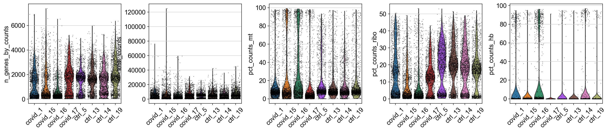
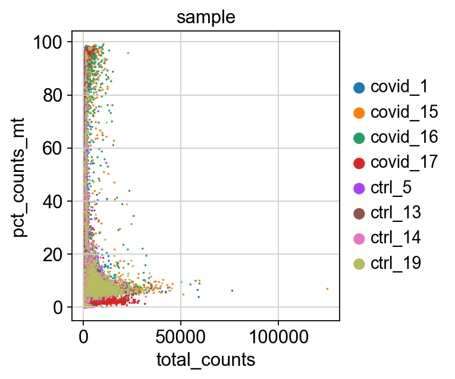
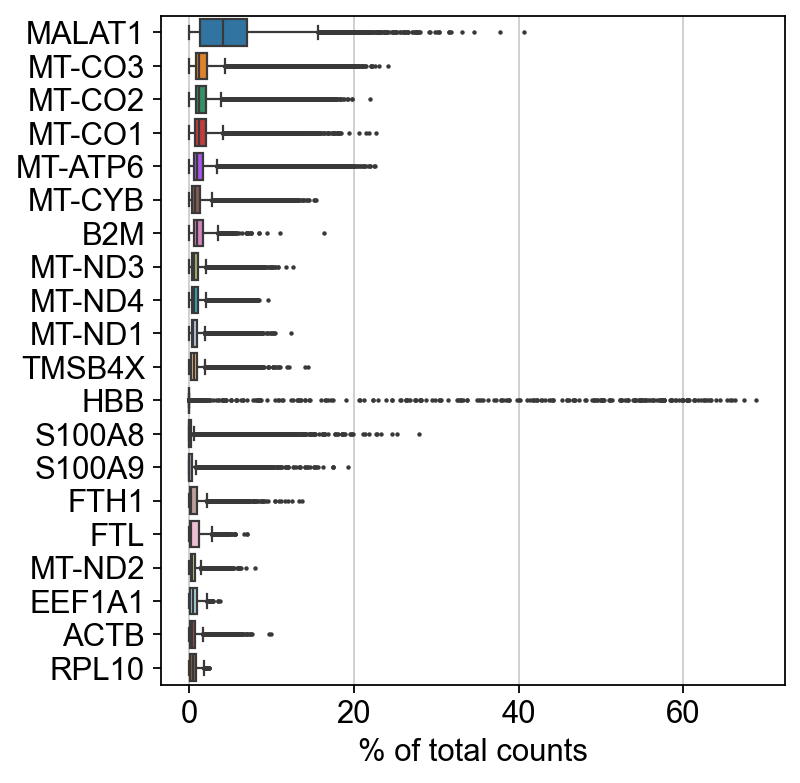
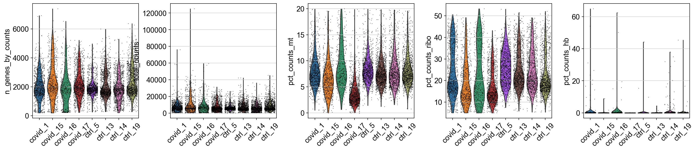
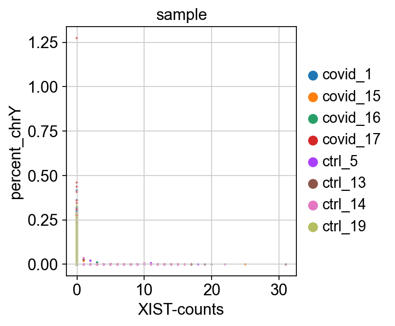
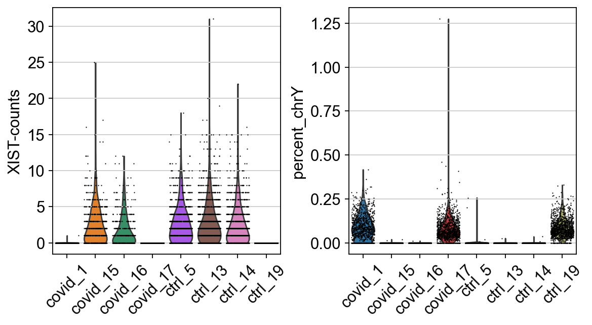
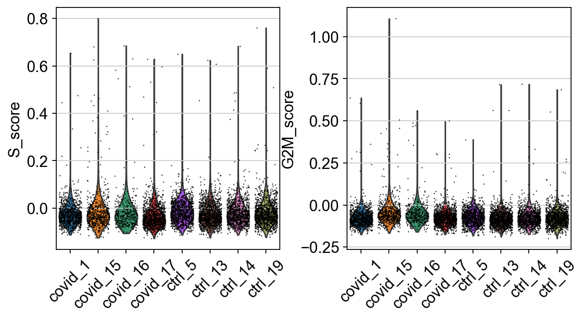
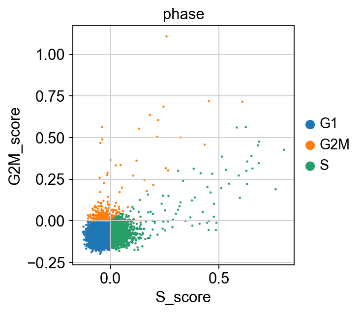
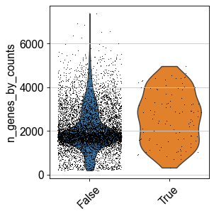
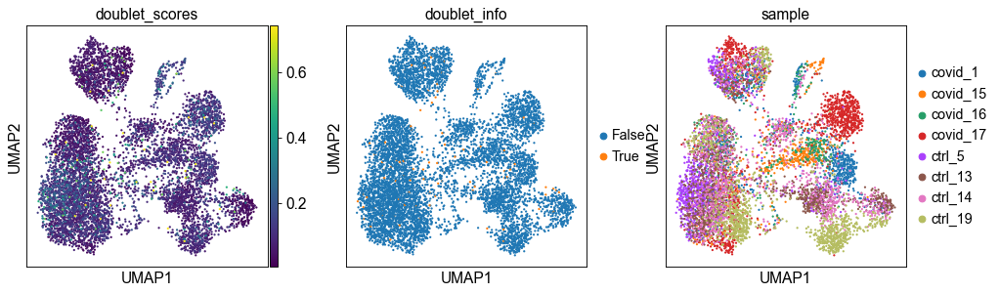

<div>

> **Note**
>
> Code chunks run Python commands unless it starts with `%%bash`, in
> which case, those chunks run shell commands.

</div>

## Get data

In this tutorial, we will run all tutorials with a set of 8 PBMC 10x
datasets from 4 covid-19 patients and 4 healthy controls, the samples
have been subsampled to 1500 cells per sample. We can start by defining
our paths.

      % Total    % Received % Xferd  Average Speed   Time    Time     Time  Current
                                     Dload  Upload   Total   Spent    Left  Speed
    100 4312k  100 4312k    0     0  1179k      0  0:00:03  0:00:03 --:--:-- 1179k
      % Total    % Received % Xferd  Average Speed   Time    Time     Time  Current
                                     Dload  Upload   Total   Spent    Left  Speed
    100 3717k  100 3717k    0     0  1089k      0  0:00:03  0:00:03 --:--:-- 1088k
      % Total    % Received % Xferd  Average Speed   Time    Time     Time  Current
                                     Dload  Upload   Total   Spent    Left  Speed
    100 4749k  100 4749k    0     0  1347k      0  0:00:03  0:00:03 --:--:-- 1347k
      % Total    % Received % Xferd  Average Speed   Time    Time     Time  Current
                                     Dload  Upload   Total   Spent    Left  Speed
    100 3789k  100 3789k    0     0  1086k      0  0:00:03  0:00:03 --:--:-- 1085k
      % Total    % Received % Xferd  Average Speed   Time    Time     Time  Current
                                     Dload  Upload   Total   Spent    Left  Speed
    100 3230k  100 3230k    0     0   925k      0  0:00:03  0:00:03 --:--:--  925k
      % Total    % Received % Xferd  Average Speed   Time    Time     Time  Current
                                     Dload  Upload   Total   Spent    Left  Speed
    100 2248k  100 2248k    0     0   619k      0  0:00:03  0:00:03 --:--:--  619k
      % Total    % Received % Xferd  Average Speed   Time    Time     Time  Current
                                     Dload  Upload   Total   Spent    Left  Speed
    100 4228k  100 4228k    0     0  1268k      0  0:00:03  0:00:03 --:--:-- 1268k
      % Total    % Received % Xferd  Average Speed   Time    Time     Time  Current
                                     Dload  Upload   Total   Spent    Left  Speed
    100 3495k  100 3495k    0     0  1053k      0  0:00:03  0:00:03 --:--:-- 1053k


With data in place, now we can start loading libraries we will use in
this tutorial.

We can first load the data individually by reading directly from HDF5
file format (.h5).

In Scanpy we read them into an Anndata object with the the function
`read_10x_h5`

    reading ./data/covid/raw/ncov_pbmc_1.h5
     (0:00:00)
    reading ./data/covid/raw/ncov_pbmc_15.h5
     (0:00:00)
    reading ./data/covid/raw/ncov_pbmc_16.h5
     (0:00:00)
    reading ./data/covid/raw/ncov_pbmc_17.h5
     (0:00:00)
    reading ./data/covid/raw/normal_pbmc_5.h5
     (0:00:00)
    reading ./data/covid/raw/normal_pbmc_13.h5
     (0:00:00)
    reading ./data/covid/raw/normal_pbmc_14.h5
     (0:00:00)
    reading ./data/covid/raw/normal_pbmc_19.h5
     (0:00:00)


## CN note： Get data
注意这里样品的文件名已经提示了样品的类型和编号


## Collate

We can now merge them objects into a single object. Each analysis
workflow (Seurat, Scater, Scanpy, etc) has its own way of storing data.
We will add dataset labels as **cell.ids** just in case you have
overlapping barcodes between the datasets. After that we add a column
**type** in the metadata to define covid and ctrl samples.


    126


You can print a summary of the datasets in the Scanpy object, or a
summary of the whole object.

## CN note： Collate （整合数据）

- 注意合并数据的方法是很简单的，只要adata.concatenate即可
- 这里删除数据之前，记得先打印一下看看格式，熟悉熟悉一下数据结构


<div>
<style scoped>
    .dataframe tbody tr th:only-of-type {
        vertical-align: middle;
    }

    .dataframe tbody tr th {
        vertical-align: top;
    }

    .dataframe thead th {
        text-align: right;
    }
</style>
<table border="1" class="dataframe">
  <thead>
    <tr style="text-align: right;">
      <th></th>
      <th>type</th>
      <th>sample</th>
    </tr>
  </thead>
  <tbody>
    <tr>
      <th>AGGTAGGTCGTTGTTT-1</th>
      <td>Covid</td>
      <td>covid_1</td>
    </tr>
    <tr>
      <th>TAGAGTCGTCCTCCAT-1</th>
      <td>Covid</td>
      <td>covid_1</td>
    </tr>
    <tr>
      <th>CCCTGATAGCGAACTG-1</th>
      <td>Covid</td>
      <td>covid_1</td>
    </tr>
    <tr>
      <th>TCATCATTCCACGTAA-1</th>
      <td>Covid</td>
      <td>covid_1</td>
    </tr>
    <tr>
      <th>ATTTACCCAAGCCTGC-1</th>
      <td>Covid</td>
      <td>covid_1</td>
    </tr>
  </tbody>
</table>
</div>


<div>
<style scoped>
    .dataframe tbody tr th:only-of-type {
        vertical-align: middle;
    }

    .dataframe tbody tr th {
        vertical-align: top;
    }

    .dataframe thead th {
        text-align: right;
    }
</style>
<table border="1" class="dataframe">
  <thead>
    <tr style="text-align: right;">
      <th></th>
      <th>type</th>
      <th>sample</th>
    </tr>
  </thead>
  <tbody>
    <tr>
      <th>ATATCCTCAGGTTTAC-19</th>
      <td>Ctrl</td>
      <td>ctrl_19</td>
    </tr>
    <tr>
      <th>TGAGACTCAACAGAGC-19</th>
      <td>Ctrl</td>
      <td>ctrl_19</td>
    </tr>
    <tr>
      <th>CGTGTCTGTTCCTACC-19</th>
      <td>Ctrl</td>
      <td>ctrl_19</td>
    </tr>
    <tr>
      <th>TGTAGACCAGATACCT-19</th>
      <td>Ctrl</td>
      <td>ctrl_19</td>
    </tr>
    <tr>
      <th>CAGTTAGCATTGCTTT-19</th>
      <td>Ctrl</td>
      <td>ctrl_19</td>
    </tr>
  </tbody>
</table>
</div>


    sample
    covid_1     1500
    covid_15    1500
    covid_16    1500
    covid_17    1500
    ctrl_5      1500
    ctrl_13     1500
    ctrl_14     1500
    ctrl_19     1500
    Name: count, dtype: int64


    AnnData object with n_obs × n_vars = 12000 × 33538
        obs: 'type', 'sample', 'batch'
        var: 'gene_ids', 'feature_types', 'genome'


## Calculate QC

Having the data in a suitable format, we can start calculating some
quality metrics. We can for example calculate the percentage of
mitochondrial and ribosomal genes per cell and add to the metadata. The
proportion of hemoglobin genes can give an indication of red blood cell
contamination, but in some tissues it can also be the case that some
celltypes have higher content of hemoglobin. This will be helpful to
visualize them across different metadata parameters (i.e. datasetID and
chemistry version). There are several ways of doing this. The QC metrics
are finally added to the metadata table.

Citing from Simple Single Cell workflows (Lun, McCarthy & Marioni,
2017): High proportions are indicative of poor-quality cells (Islam et
al. 2014; Ilicic et al. 2016), possibly because of loss of cytoplasmic
RNA from perforated cells. The reasoning is that mitochondria are larger
than individual transcript molecules and less likely to escape through
tears in the cell membrane.

First, let Scanpy calculate some general qc-stats for genes and cells
with the function `sc.pp.calculate_qc_metrics`, similar to
`calculateQCmetrics()` in Scater. It can also calculate proportion of
counts for specific gene populations, so first we need to define which
genes are mitochondrial, ribosomal and hemoglobin.

## CN note：Calculate QC

- 每个细胞的线粒体和核糖体基因百分比
    - 于穿孔细胞导致胞质 RNA 丢失。其原因在于，线粒体比单个转录分子更大。因此濒死细胞或低质量，线粒体转录本占比高
- 血红蛋白基因的比例可以指示红细胞的污染情况

- 先定义哪些是线粒体基因，ribosomal genes和hemoglobin genes.


<div>
<style scoped>
    .dataframe tbody tr th:only-of-type {
        vertical-align: middle;
    }

    .dataframe tbody tr th {
        vertical-align: top;
    }

    .dataframe thead th {
        text-align: right;
    }
</style>
<table border="1" class="dataframe">
  <thead>
    <tr style="text-align: right;">
      <th></th>
      <th>gene_ids</th>
      <th>feature_types</th>
      <th>genome</th>
      <th>mt</th>
      <th>ribo</th>
      <th>hb</th>
    </tr>
  </thead>
  <tbody>
    <tr>
      <th>MIR1302-2HG</th>
      <td>ENSG00000243485</td>
      <td>Gene Expression</td>
      <td>GRCh38</td>
      <td>False</td>
      <td>False</td>
      <td>False</td>
    </tr>
    <tr>
      <th>FAM138A</th>
      <td>ENSG00000237613</td>
      <td>Gene Expression</td>
      <td>GRCh38</td>
      <td>False</td>
      <td>False</td>
      <td>False</td>
    </tr>
    <tr>
      <th>OR4F5</th>
      <td>ENSG00000186092</td>
      <td>Gene Expression</td>
      <td>GRCh38</td>
      <td>False</td>
      <td>False</td>
      <td>False</td>
    </tr>
    <tr>
      <th>AL627309.1</th>
      <td>ENSG00000238009</td>
      <td>Gene Expression</td>
      <td>GRCh38</td>
      <td>False</td>
      <td>False</td>
      <td>False</td>
    </tr>
    <tr>
      <th>AL627309.3</th>
      <td>ENSG00000239945</td>
      <td>Gene Expression</td>
      <td>GRCh38</td>
      <td>False</td>
      <td>False</td>
      <td>False</td>
    </tr>
    <tr>
      <th>...</th>
      <td>...</td>
      <td>...</td>
      <td>...</td>
      <td>...</td>
      <td>...</td>
      <td>...</td>
    </tr>
    <tr>
      <th>AC233755.2</th>
      <td>ENSG00000277856</td>
      <td>Gene Expression</td>
      <td>GRCh38</td>
      <td>False</td>
      <td>False</td>
      <td>False</td>
    </tr>
    <tr>
      <th>AC233755.1</th>
      <td>ENSG00000275063</td>
      <td>Gene Expression</td>
      <td>GRCh38</td>
      <td>False</td>
      <td>False</td>
      <td>False</td>
    </tr>
    <tr>
      <th>AC240274.1</th>
      <td>ENSG00000271254</td>
      <td>Gene Expression</td>
      <td>GRCh38</td>
      <td>False</td>
      <td>False</td>
      <td>False</td>
    </tr>
    <tr>
      <th>AC213203.1</th>
      <td>ENSG00000277475</td>
      <td>Gene Expression</td>
      <td>GRCh38</td>
      <td>False</td>
      <td>False</td>
      <td>False</td>
    </tr>
    <tr>
      <th>FAM231C</th>
      <td>ENSG00000268674</td>
      <td>Gene Expression</td>
      <td>GRCh38</td>
      <td>False</td>
      <td>False</td>
      <td>False</td>
    </tr>
  </tbody>
</table>
<p>33538 rows × 6 columns</p>
</div>


Now you can see that we have additional data in the metadata slot.

Another opition to using the `calculate_qc_metrics` function is to
calculate the values on your own and add to a metadata slot. An example
for mito genes can be found below:


    AnnData object with n_obs × n_vars = 12000 × 33538
        obs: 'type', 'sample', 'batch', 'n_genes_by_counts', 'total_counts', 'total_counts_mt', 'pct_counts_mt', 'total_counts_ribo', 'pct_counts_ribo', 'total_counts_hb', 'pct_counts_hb', 'percent_mt2', 'n_counts'
        var: 'gene_ids', 'feature_types', 'genome', 'mt', 'ribo', 'hb', 'n_cells_by_counts', 'mean_counts', 'pct_dropout_by_counts', 'total_counts'


## Plot QC

Now we can plot some of the QC variables as violin plots.

## CN note： Plot QC

质量控制的绘图，能看到一些分布，但不提供确定的QC cut-off


    

    


<div>

> **Discuss**
>
> Looking at the violin plots, what do you think are appropriate cutoffs
> for filtering these samples

</div>

As you can see, there is quite some difference in quality for these
samples, with for instance the covid_15 and covid_16 samples having
cells with fewer detected genes and more mitochondrial content. As the
ribosomal proteins are highly expressed they will make up a larger
proportion of the transcriptional landscape when fewer of the lowly
expressed genes are detected. We can also plot the different QC-measures
as scatter plots.


    

    


<div>

> **Discuss**
>
> Plot additional QC stats that we have calculated as scatter plots. How
> are the different measures correlated? Can you explain why?

</div>

## Filtering

## CN note: Filtering

- 至少检测到 200 个基因且基因需要在至少 3 个细胞中表达的细胞
- Extremely high number of detected genes could indicate doublets, 检测到的基因数量极高可能表明存在双联体


### Detection-based filtering

A standard approach is to filter cells with low number of reads as well
as genes that are present in at least a given number of cells. Here we
will only consider cells with at least 200 detected genes and genes need
to be expressed in at least 3 cells. Please note that those values are
highly dependent on the library preparation method used.

    filtered out 1336 cells that have less than 200 genes expressed
    filtered out 14047 genes that are detected in less than 3 cells
    10664 19491


Extremely high number of detected genes could indicate doublets.
However, depending on the cell type composition in your sample, you may
have cells with higher number of genes (and also higher counts) from one
cell type. In this case, we will run doublet prediction further down, so
we will skip this step now, but the code below is an example of how it
can be run:

Additionally, we can also see which genes contribute the most to such
reads. We can for instance plot the percentage of counts per gene.

    normalizing counts per cell
        finished (0:00:00)


    

    


As you can see, MALAT1 constitutes up to 30% of the UMIs from a single
cell and the other top genes are mitochondrial and ribosomal genes. It
is quite common that nuclear lincRNAs have correlation with quality and
mitochondrial reads, so high detection of MALAT1 may be a technical
issue. Let us assemble some information about such genes, which are
important for quality control and downstream filtering.

### Mito/Ribo filtering

We also have quite a lot of cells with high proportion of mitochondrial
and low proportion of ribosomal reads. It would be wise to remove those
cells, if we have enough cells left after filtering. Another option
would be to either remove all mitochondrial reads from the dataset and
hope that the remaining genes still have enough biological signal. A
third option would be to just regress out the `percent_mito` variable
during scaling. In this case we had as much as 99.7% mitochondrial reads
in some of the cells, so it is quite unlikely that there is much cell
type signature left in those. Looking at the plots, make reasonable
decisions on where to draw the cutoff. In this case, the bulk of the
cells are below 20% mitochondrial reads and that will be used as a
cutoff. We will also remove cells with less than 5% ribosomal reads.

## CN note: Mito/Ribo filtering

- pct_counts_mt 低较好，细胞无转录组渗漏
- pct_counts_ribo不能太低，但为什么不清楚


As the ribosomal proteins are highly expressed they will make up a larger proportion of the transcriptional landscape when fewer of the lowly expressed genes are detected。
按理说，高核糖体基因比例，显示了对低表达基因的检出情况较差。但为什么要维持在一个高的比例呢，有低表达基因的量可能是和doublets正相关？

- 这里的过滤方式直接用了python数据结构来操作


    Remaining cells 7431


As you can see, a large proportion of sample covid_15 is filtered out.
Also, there is still quite a lot of variation in `percent_mito`, so it
will have to be dealt with in the data analysis step. We can also notice
that the `percent_ribo` are also highly variable, but that is expected
since different cell types have different proportions of ribosomal
content, according to their function.

### Plot filtered QC

Lets plot the same QC-stats once more.


    

    


### Filter genes

As the level of expression of mitochondrial and MALAT1 genes are judged
as mainly technical, it can be wise to remove them from the dataset
before any further analysis. In this case we will also remove the HB
genes.

## CN note: Filter genes

### 保留的特征基因

- 这里做了移除基因的操作，原因在于他们的差异源于技术因素，且对功能差异的贡献较小。并且由于细胞穿孔，红细胞污染等因素，也会引入bias，因此移除这些基因。


    7431 19468


## Sample sex

When working with human or animal samples, you should ideally constrain
your experiments to a single sex to avoid including sex bias in the
conclusions. However this may not always be possible. By looking at
reads from chromosomeY (males) and XIST (X-inactive specific transcript)
expression (mainly female) it is quite easy to determine per sample
which sex it is. It can also be a good way to detect if there has been
any mislabelling in which case, the sample metadata sex does not agree
with the computational predictions.

To get choromosome information for all genes, you should ideally parse
the information from the gtf file that you used in the mapping pipeline
as it has the exact same annotation version/gene naming. However, it may
not always be available, as in this case where we have downloaded public
data. Hence, we will use biomart to fetch chromosome information.

Now that we have the chromosome information, we can calculate the
proportion of reads that comes from chromosome Y per cell.But first we
have to remove all genes in the pseudoautosmal regions of chrY that are:
\* chromosome:GRCh38:Y:10001 - 2781479 is shared with X: 10001 - 2781479
(PAR1) \* chromosome:GRCh38:Y:56887903 - 57217415 is shared with X:
155701383 - 156030895 (PAR2)

Then plot XIST expression vs chrY proportion. As you can see, the
samples are clearly on either side, even if some cells do not have
detection of either.


    

    


Plot as violins.


    

    


Here, we can see clearly that we have three males and five females, can
you see which samples they are? Do you think this will cause any
problems for downstream analysis? Discuss with your group: what would be
the best way to deal with this type of sex bias?

## Cell cycle state

We here perform cell cycle scoring. To score a gene list, the algorithm
calculates the difference of mean expression of the given list and the
mean expression of reference genes. To build the reference, the function
randomly chooses a bunch of genes matching the distribution of the
expression of the given list. Cell cycle scoring adds three slots in the
metadata, a score for S phase, a score for G2M phase and the predicted
cell cycle phase.

First read the file with cell cycle genes, from Regev lab and split into
S and G2M phase genes. We first download the file.

      % Total    % Received % Xferd  Average Speed   Time    Time     Time  Current
                                     Dload  Upload   Total   Spent    Left  Speed
    100   556  100   556    0     0    323      0  0:00:01  0:00:01 --:--:--   323


    97
    94


Before running cell cycle we have to normalize the data. In the scanpy
object, the data slot will be overwritten with the normalized data. So
first, save the raw data into the slot `raw`. Then run normalization,
log transformation and scale the data.

    normalizing counts per cell
        finished (0:00:00)
    ... as `zero_center=True`, sparse input is densified and may lead to large memory consumption


We here perform cell cycle scoring. The function is actually a wrapper
to sc.tl.score_gene_list, which is launched twice, to score separately S
and G2M phases. Both sc.tl.score_gene_list and
sc.tl.score_cell_cycle_genes are a port from Seurat and are supposed to
work in a very similar way. To score a gene list, the algorithm
calculates the difference of mean expression of the given list and the
mean expression of reference genes. To build the reference, the function
randomly chooses a bunch of genes matching the distribution of the
expression of the given list. Cell cycle scoring adds three slots in
data, a score for S phase, a score for G2M phase and the predicted cell
cycle phase.

    calculating cell cycle phase
    computing score 'S_score'
    WARNING: genes are not in var_names and ignored: Index(['MLF1IP'], dtype='object')
        finished: added
        'S_score', score of gene set (adata.obs).
        688 total control genes are used. (0:00:00)
    computing score 'G2M_score'
    WARNING: genes are not in var_names and ignored: Index(['FAM64A', 'HN1'], dtype='object')
        finished: added
        'G2M_score', score of gene set (adata.obs).
        815 total control genes are used. (0:00:00)
    -->     'phase', cell cycle phase (adata.obs)


We can now create a violin plot for the cell cycle scores as well.


    

    


In this case it looks like we only have a few cycling cells in these
datasets.

Scanpy does an automatic prediction of cell cycle phase with a default
cutoff of the scores at zero. As you can see this does not fit this data
very well, so be cautios with using these predictions. Instead we
suggest that you look at the scores.


    

    


## Predict doublets

Doublets/Multiples of cells in the same well/droplet is a common issue
in scRNAseq protocols. Especially in droplet-based methods with
overloading of cells. In a typical 10x experiment the proportion of
doublets is linearly dependent on the amount of loaded cells. As
indicated from the Chromium user guide, doublet rates are about as
follows:\
\
Most doublet detectors simulates doublets by merging cell counts and
predicts doublets as cells that have similar embeddings as the simulated
doublets. Most such packages need an assumption about the
number/proportion of expected doublets in the dataset. The data you are
using is subsampled, but the original datasets contained about 5 000
cells per sample, hence we can assume that they loaded about 9 000 cells
and should have a doublet rate at about 4%.

For doublet detection, we will use the package `Scrublet`, so first we
need to get the raw counts from `adata.raw.X` and run scrublet with that
matrix. Then we add in the doublet prediction info into our anndata
object.

Doublet prediction should be run for each dataset separately, so first
we need to split the adata object into 6 separate objects, one per
sample and then run scrublet on each of them.

## CN note: Predict doublets

在典型的 10x 实验中，双联体的比例与上样细胞的数量呈线性关系。因此这是个根据趋势来预测的工作。

Most doublet detectors simulates doublets by merging cell counts and predicts doublets as cells that have similar embeddings as the simulated doublets. Most such packages need an assumption about the number/proportion of expected doublets in the dataset. The data you are using is subsampled, but the original datasets contained about **5 000 cells per sample**, hence we can assume that **they loaded about 9 000 cells** and should have a doublet rate at about 4%.

这里的假设是需要分析师来确认伤样的模式，即单次上样的细胞量。这里缺失了一张表的截图，展示 loaded call count 和 doublet 比例的对应关系。

这里要用到批次 batch 信息，这里对应的是 sample。

- 我们应该预期两个细胞比单个细胞检测到更多的基因，让我们检查一下我们预测的双联体是否总体上也检测到更多的基因。

这个信息可以画图展示


    covid_1 : 900  cells
    14  predicted_doublets
    covid_15 : 599  cells
    0  predicted_doublets
    covid_16 : 373  cells
    4  predicted_doublets
    covid_17 : 1101  cells
    7  predicted_doublets
    ctrl_5 : 1052  cells
    21  predicted_doublets
    ctrl_13 : 1173  cells
    18  predicted_doublets
    ctrl_14 : 1063  cells
    23  predicted_doublets
    ctrl_19 : 1170  cells
    16  predicted_doublets


    {'covid_1':                       doublet_score  predicted_doublets
     TAGAGTCGTCCTCCAT-1-0       0.054795               False
     CCCTGATAGCGAACTG-1-0       0.059382               False
     ATTTACCCAAGCCTGC-1-0       0.082153               False
     GTTGTCCTCTAGAACC-1-0       0.075676               False
     AATAGAGGTGTGAGCA-1-0       0.027875               False
     ...                             ...                 ...
     ATCCTATAGAGTCAGC-1-0       0.030521               False
     AGTCATGTCCAAATGC-1-0       0.059382               False
     CCGATCTTCTATCGCC-1-0       0.069767               False
     GTAATCGGTAAGCTCT-1-0       0.050549               False
     TCATGAGGTGATCGTT-1-0       0.069767               False
     
     [900 rows x 2 columns],
     'covid_15':                        doublet_score  predicted_doublets
     TTTCAGTTCTATCGCC-15-1       0.070968               False
     CTATAGGTCCACCTCA-15-1       0.120000               False
     GTGGCGTCAACTTGGT-15-1       0.096525               False
     ATCGTGATCGCCGTGA-15-1       0.134615               False
     AGAGAGCTCAAAGCCT-15-1       0.086957               False
     ...                              ...                 ...
     AGGTCATCAACGCCCA-15-1       0.151832               False
     GTAGATCTCATTGCTT-15-1       0.078498               False
     TCCTGCATCTTTCAGT-15-1       0.096525               False
     CATCCACTCACGTAGT-15-1       0.151832               False
     ATTCCTAGTTGCGTAT-15-1       0.016949               False
     
     [599 rows x 2 columns],
     'covid_16':                        doublet_score  predicted_doublets
     TTCACGCTCTACTATC-16-2       0.124324               False
     TTCATTGAGCACCGAA-16-2       0.046729               False
     CATCCCACAGGAAGTC-16-2       0.066667               False
     GCAACATTCACCCATC-16-2       0.046729               False
     CCCGAAGAGAGTTCGG-16-2       0.052632               False
     ...                              ...                 ...
     TAACCAGCAGAGGAAA-16-2       0.059233               False
     GTTCCGTAGTTCATGC-16-2       0.046729               False
     CGCCAGAAGGGCAGTT-16-2       0.084746               False
     ACGGTCGCAAAGTATG-16-2       0.046729               False
     TGAATCGGTGGTTTAC-16-2       0.066667               False
     
     [373 rows x 2 columns],
     'covid_17':                        doublet_score  predicted_doublets
     GGTGAAGGTGGGTATG-17-3       0.067568               False
     ACCTGTCTCACGGGAA-17-3       0.105263               False
     GCTGGGTGTATGCAAA-17-3       0.083969               False
     TTTCAGTTCGATTCCC-17-3       0.145985               False
     AGTTCGAAGCACTGGA-17-3       0.090426               False
     ...                              ...                 ...
     AGGCCACGTCAGCTTA-17-3       0.105263               False
     CTTCTCTCAAATGAGT-17-3       0.062907               False
     GTCGAATAGGCCATAG-17-3       0.090426               False
     TTTGATCCATGAAGCG-17-3       0.213592               False
     TACCCGTTCACGATAC-17-3       0.090426               False
     
     [1101 rows x 2 columns],
     'ctrl_5':                       doublet_score  predicted_doublets
     AGGTCTAGTAGCTTAC-5-4       0.181818               False
     TCAGGGCTCTCCCTAG-5-4       0.056769               False
     CAAAGAAAGGAGGGTG-5-4       0.164557               False
     AATCGTGTCATTCGGA-5-4       0.066038               False
     GGTCACGCATTACGGT-5-4       0.030303               False
     ...                             ...                 ...
     TTTGATCAGGCCTTCG-5-4       0.052632               False
     CGGGTGTGTTGTGTAC-5-4       0.030303               False
     TCGAACATCGTGGACC-5-4       0.048780               False
     CATTGCCGTGAATAAC-5-4       0.225806               False
     CAGTTCCTCGGCAGTC-5-4       0.149606               False
     
     [1052 rows x 2 columns],
     'ctrl_13':                        doublet_score  predicted_doublets
     AGGTCATGTGCGAACA-13-5       0.047259               False
     CCTATCGGTCCCTCAT-13-5       0.213592               False
     TCCTCCCTCGTTCATT-13-5       0.134021               False
     CAACCAATCATCTATC-13-5       0.145985               False
     TACGGTATCGGATTAC-13-5       0.047259               False
     ...                              ...                 ...
     TCCACCATCATAGCAC-13-5       0.072600               False
     GAGTTACAGTGAGTGC-13-5       0.054545               False
     ATCATTCAGGCTCACC-13-5       0.072600               False
     AGCCACGCAACCCTAA-13-5       0.047259               False
     CTACCTGGTCAGGAGT-13-5       0.238095               False
     
     [1173 rows x 2 columns],
     'ctrl_14':                        doublet_score  predicted_doublets
     AGGGTCCGTGAGATTA-14-6       0.052632               False
     TACCGAACAGGGATAC-14-6       0.136531               False
     CCACTTGTCGCGGTAC-14-6       0.045187               False
     ATTCCCGGTTGACTAC-14-6       0.149606               False
     GTTATGGTCTTTCGAT-14-6       0.032929               False
     ...                              ...                 ...
     CGCATAATCTTACGGA-14-6       0.052632               False
     GAGGCCTTCTCCTGCA-14-6       0.149606               False
     CCCTAACAGTTTCTTC-14-6       0.041825               False
     GGGATGATCAAGCTTG-14-6       0.032929               False
     CAATGACCACTGCATA-14-6       0.254438               False
     
     [1063 rows x 2 columns],
     'ctrl_19':                        doublet_score  predicted_doublets
     TGAGACTCAACAGAGC-19-7       0.035176               False
     CGTGTCTGTTCCTACC-19-7       0.017735               False
     TGTAGACCAGATACCT-19-7       0.097493               False
     CAGTTAGCATTGCTTT-19-7       0.058577               False
     TCGACGGGTTCGGCTG-19-7       0.097493               False
     ...                              ...                 ...
     TTCTTGAGTATCAGGG-19-7       0.113846               False
     GTAGCTAGTAATGCTC-19-7       0.067568               False
     GCCAACGGTAAGTTAG-19-7       0.097493               False
     TCGGGACAGTCGTCTA-19-7       0.090426               False
     GGGTCACCAACATACC-19-7       0.159533               False
     
     [1170 rows x 2 columns]}


We should expect that two cells have more detected genes than a single
cell, lets check if our predicted doublets also have more detected genes
in general.


    

    


Now, lets run PCA and UMAP and plot doublet scores onto UMAP to check
the doublet predictions. We will go through these steps in more detail
in the later exercises.

    extracting highly variable genes
        finished (0:00:01)
    --> added
        'highly_variable', boolean vector (adata.var)
        'means', float vector (adata.var)
        'dispersions', float vector (adata.var)
        'dispersions_norm', float vector (adata.var)
    regressing out ['total_counts', 'pct_counts_mt']
        finished (0:00:00)
    computing PCA
        with n_comps=50
        finished (0:00:00)
    computing neighbors
        using 'X_pca' with n_pcs = 40
        finished: added to `.uns['neighbors']`
        `.obsp['distances']`, distances for each pair of neighbors
        `.obsp['connectivities']`, weighted adjacency matrix (0:00:04)
    computing UMAP
        finished: added
        'X_umap', UMAP coordinates (adata.obsm)
        'umap', UMAP parameters (adata.uns) (0:00:04)


    

    


Now, lets remove all predicted doublets from our data.

    (7328, 19468)


To summarize, lets check how many cells we have removed per sample, we
started with 1500 cells per sample. Looking back at the intitial QC
plots does it make sense that some samples have much fewer cells now?

``` {r}
#| label: view-data
adata.obs["sample"].value_counts()
```

<div>

> **Discuss**
>
> "In this case we ran doublet detection with all samples together since
> we have very small subsampled datasets. But in a real scenario it
> should be run one sample at a time. Why is this important do you
> think?"

</div>

## Save data

Finally, lets save the QC-filtered data for further analysis. Create
output directory `data/covid/results` and save data to that folder. This
will be used in downstream labs.

## Session info

```{=html}
<details>
```
```{=html}
<summary>
```
Click here
```{=html}
</summary>
```


<table class=table>
            <thead style="position: sticky; top: 0; background-color: var(--jp-layout-color0, var(--vscode-editor-background, white));">
        <tr><th>Package</th><th>Version</th></tr>
    </thead>
    <tbody>
        <tr><td><strong>anndata</strong></td><td>0.11.4</td></tr>
        <tr><td><strong>pandas</strong></td><td>2.2.3</td></tr>
        <tr><td><strong>numpy</strong></td><td>2.2.5</td></tr>
        <tr><td><strong>scanpy</strong></td><td>1.11.1</td></tr>
        <tr><td><strong>scrublet</strong></td><td>0.2.3</td></tr>
    </tbody>
    <thead style="position: sticky; top: 0; background-color: var(--jp-layout-color0, var(--vscode-editor-background, white));">
        <tr><th>Component</th><th>Info</th></tr>
    </thead>
    <tbody>
        <tr><td>Python</td><td>3.12.9 | packaged by Anaconda, Inc. | (main, Feb  6 2025, 12:55:12) [Clang 14.0.6 ]</td></tr>
        <tr><td>OS</td><td>macOS-15.5-arm64-arm-64bit</td></tr>
        <tr><td>CPU</td><td>12 logical CPU cores, arm</td></tr>
        <tr><td>GPU</td><td>No GPU found</td></tr>
        <tr><td>Updated</td><td>2025-05-23 08:46</td></tr>
    </tbody>
        </table>

        <details>
        <summary>Dependencies</summary>
                <div style="max-height: min(500px, 80vh); overflow-y: auto;">
    <table class=table>
            <thead style="position: sticky; top: 0; background-color: var(--jp-layout-color0, var(--vscode-editor-background, white));">
    <tr><th>Dependency</th><th>Version</th></tr>
</thead>
<tbody>
    <tr><td>PySocks</td><td>1.7.1</td></tr>
    <tr><td>umap-learn</td><td>0.5.7</td></tr>
    <tr><td>parso</td><td>0.8.4</td></tr>
    <tr><td>joblib</td><td>1.5.0</td></tr>
    <tr><td>ipykernel</td><td>6.29.5</td></tr>
    <tr><td>prompt-toolkit</td><td>3.0.43</td></tr>
    <tr><td>debugpy</td><td>1.8.11</td></tr>
    <tr><td>traitlets</td><td>5.14.3</td></tr>
    <tr><td>jedi</td><td>0.19.2</td></tr>
    <tr><td>executing</td><td>0.8.3</td></tr>
    <tr><td>matplotlib</td><td>3.10.3</td></tr>
    <tr><td>charset-normalizer</td><td>3.3.2</td></tr>
    <tr><td>cattrs</td><td>24.1.3</td></tr>
    <tr><td>tornado</td><td>6.4.2</td></tr>
    <tr><td>lazy_loader</td><td>0.4</td></tr>
    <tr><td>scipy</td><td>1.15.3</td></tr>
    <tr><td>natsort</td><td>8.4.0</td></tr>
    <tr><td>texttable</td><td>1.7.0</td></tr>
    <tr><td>psutil</td><td>5.9.0</td></tr>
    <tr><td>decorator</td><td>5.1.1</td></tr>
    <tr><td>scikit-learn</td><td>1.5.2</td></tr>
    <tr><td>session-info2</td><td>0.1.2</td></tr>
    <tr><td>wcwidth</td><td>0.2.5</td></tr>
    <tr><td>packaging</td><td>24.2</td></tr>
    <tr><td>Pygments</td><td>2.19.1</td></tr>
    <tr><td>llvmlite</td><td>0.44.0</td></tr>
    <tr><td>pycparser</td><td>2.21</td></tr>
    <tr><td>PyYAML</td><td>6.0.2</td></tr>
    <tr><td>future</td><td>1.0.0</td></tr>
    <tr><td>patsy</td><td>1.0.1</td></tr>
    <tr><td>statsmodels</td><td>0.14.4</td></tr>
    <tr><td>legacy-api-wrap</td><td>1.4.1</td></tr>
    <tr><td>cffi</td><td>1.17.1</td></tr>
    <tr><td>pillow</td><td>11.2.1</td></tr>
    <tr><td>h5py</td><td>3.13.0</td></tr>
    <tr><td>tqdm</td><td>4.67.1</td></tr>
    <tr><td>ipython</td><td>9.1.0</td></tr>
    <tr><td>requests</td><td>2.32.3</td></tr>
    <tr><td>defusedxml</td><td>0.7.1</td></tr>
    <tr><td>jupyter_client</td><td>8.6.3</td></tr>
    <tr><td>typing_extensions</td><td>4.12.2</td></tr>
    <tr><td>numba</td><td>0.61.2</td></tr>
    <tr><td>idna</td><td>3.7</td></tr>
    <tr><td>url-normalize</td><td>2.2.1</td></tr>
    <tr><td>scikit-image</td><td>0.25.2</td></tr>
    <tr><td>pyparsing</td><td>3.2.3</td></tr>
    <tr><td>requests-cache</td><td>1.2.1</td></tr>
    <tr><td>pybiomart</td><td>0.2.0</td></tr>
    <tr><td>appnope</td><td>0.1.3</td></tr>
    <tr><td>pytz</td><td>2025.2</td></tr>
    <tr><td>six</td><td>1.17.0</td></tr>
    <tr><td>annoy</td><td>1.17.3</td></tr>
    <tr><td>python-dateutil</td><td>2.9.0.post0</td></tr>
    <tr><td>attrs</td><td>24.3.0</td></tr>
    <tr><td>seaborn</td><td>0.13.2</td></tr>
    <tr><td>igraph</td><td>0.11.8</td></tr>
    <tr><td>threadpoolctl</td><td>3.6.0</td></tr>
    <tr><td>urllib3</td><td>2.3.0</td></tr>
    <tr><td>pure-eval</td><td>0.2.2</td></tr>
    <tr><td>kiwisolver</td><td>1.4.8</td></tr>
    <tr><td>jupyter_core</td><td>5.7.2</td></tr>
    <tr><td>leidenalg</td><td>0.10.2</td></tr>
    <tr><td>Cython</td><td>3.1.0</td></tr>
    <tr><td>stack-data</td><td>0.2.0</td></tr>
    <tr><td>asttokens</td><td>3.0.0</td></tr>
    <tr><td>comm</td><td>0.2.1</td></tr>
    <tr><td>matplotlib-inline</td><td>0.1.6</td></tr>
    <tr><td>cycler</td><td>0.12.1</td></tr>
    <tr><td>pyzmq</td><td>26.2.0</td></tr>
    <tr><td>setuptools</td><td>78.1.1</td></tr>
    <tr><td>pynndescent</td><td>0.5.13</td></tr>
    <tr><td>platformdirs</td><td>4.3.7</td></tr>
    <tr><td>Brotli</td><td>1.0.9</td></tr>
    <tr><td>certifi</td><td>2025.4.26 (2025.04.26)</td></tr>
</tbody>
    </table>
</div>
    </details>
        <details>
            <summary>Copyable Markdown</summary>
            <pre>| Package  | Version |
| -------- | ------- |
| anndata  | 0.11.4  |
| pandas   | 2.2.3   |
| numpy    | 2.2.5   |
| scanpy   | 1.11.1  |
| scrublet | 0.2.3   |

| Dependency         | Version                |
| ------------------ | ---------------------- |
| PySocks            | 1.7.1                  |
| umap-learn         | 0.5.7                  |
| parso              | 0.8.4                  |
| joblib             | 1.5.0                  |
| ipykernel          | 6.29.5                 |
| prompt-toolkit     | 3.0.43                 |
| debugpy            | 1.8.11                 |
| traitlets          | 5.14.3                 |
| jedi               | 0.19.2                 |
| executing          | 0.8.3                  |
| matplotlib         | 3.10.3                 |
| charset-normalizer | 3.3.2                  |
| cattrs             | 24.1.3                 |
| tornado            | 6.4.2                  |
| lazy_loader        | 0.4                    |
| scipy              | 1.15.3                 |
| natsort            | 8.4.0                  |
| texttable          | 1.7.0                  |
| psutil             | 5.9.0                  |
| decorator          | 5.1.1                  |
| scikit-learn       | 1.5.2                  |
| session-info2      | 0.1.2                  |
| wcwidth            | 0.2.5                  |
| packaging          | 24.2                   |
| Pygments           | 2.19.1                 |
| llvmlite           | 0.44.0                 |
| pycparser          | 2.21                   |
| PyYAML             | 6.0.2                  |
| future             | 1.0.0                  |
| patsy              | 1.0.1                  |
| statsmodels        | 0.14.4                 |
| legacy-api-wrap    | 1.4.1                  |
| cffi               | 1.17.1                 |
| pillow             | 11.2.1                 |
| h5py               | 3.13.0                 |
| tqdm               | 4.67.1                 |
| ipython            | 9.1.0                  |
| requests           | 2.32.3                 |
| defusedxml         | 0.7.1                  |
| jupyter_client     | 8.6.3                  |
| typing_extensions  | 4.12.2                 |
| numba              | 0.61.2                 |
| idna               | 3.7                    |
| url-normalize      | 2.2.1                  |
| scikit-image       | 0.25.2                 |
| pyparsing          | 3.2.3                  |
| requests-cache     | 1.2.1                  |
| pybiomart          | 0.2.0                  |
| appnope            | 0.1.3                  |
| pytz               | 2025.2                 |
| six                | 1.17.0                 |
| annoy              | 1.17.3                 |
| python-dateutil    | 2.9.0.post0            |
| attrs              | 24.3.0                 |
| seaborn            | 0.13.2                 |
| igraph             | 0.11.8                 |
| threadpoolctl      | 3.6.0                  |
| urllib3            | 2.3.0                  |
| pure-eval          | 0.2.2                  |
| kiwisolver         | 1.4.8                  |
| jupyter_core       | 5.7.2                  |
| leidenalg          | 0.10.2                 |
| Cython             | 3.1.0                  |
| stack-data         | 0.2.0                  |
| asttokens          | 3.0.0                  |
| comm               | 0.2.1                  |
| matplotlib-inline  | 0.1.6                  |
| cycler             | 0.12.1                 |
| pyzmq              | 26.2.0                 |
| setuptools         | 78.1.1                 |
| pynndescent        | 0.5.13                 |
| platformdirs       | 4.3.7                  |
| Brotli             | 1.0.9                  |
| certifi            | 2025.4.26 (2025.04.26) |

| Component | Info                                                                                |
| --------- | ----------------------------------------------------------------------------------- |
| Python    | 3.12.9 | packaged by Anaconda, Inc. | (main, Feb  6 2025, 12:55:12) [Clang 14.0.6 ] |
| OS        | macOS-15.5-arm64-arm-64bit                                                          |
| CPU       | 12 logical CPU cores, arm                                                           |
| GPU       | No GPU found                                                                        |
| Updated   | 2025-05-23 08:46                                                                    |</pre>
        </details>


```{=html}
</details>
```

    [NbConvertApp] Converting notebook scanpy_01_qc.ipynb to html
    [NbConvertApp] WARNING | Alternative text is missing on 10 image(s).
    [NbConvertApp] Writing 2802552 bytes to scanpy_01_qc.html


## archive

    [NbConvertApp] Making directory archive
    [NbConvertApp] Converting notebook scanpy_01_qc--test.ipynb to html
    [NbConvertApp] WARNING | Alternative text is missing on 10 image(s).
    [NbConvertApp] Writing 2803234 bytes to archive/scanpy_01_qc--test.html


    [NbConvertApp] Converting notebook scanpy_01_qc--test.ipynb to markdown
    [NbConvertApp] Support files will be in scanpy_01_qc--test_files/
    [NbConvertApp] Making directory archive/scanpy_01_qc--test_files
    [NbConvertApp] Writing 41622 bytes to archive/scanpy_01_qc--test.md

