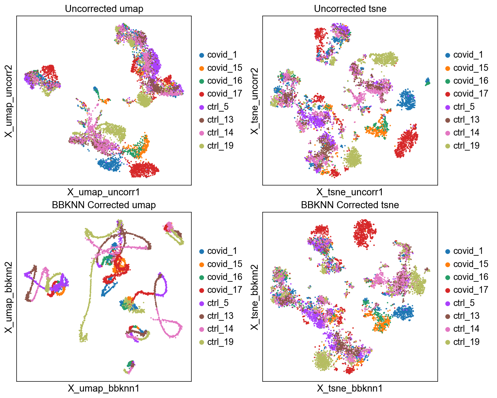
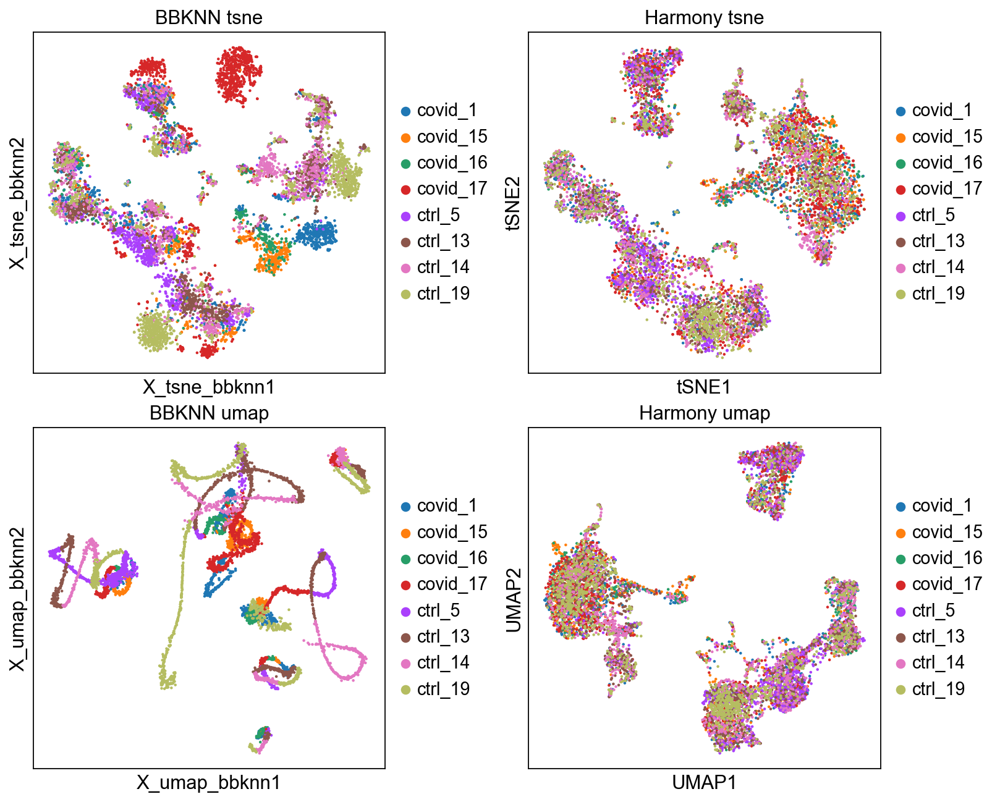

<div>

> **Note**
>
> Code chunks run Python commands unless it starts with `%%bash`, in
> which case, those chunks run shell commands.

</div>

In this tutorial we will look at different ways of integrating multiple
single cell RNA-seq datasets. We will explore a few different methods to
correct for batch effects across datasets. Seurat uses the data
integration method presented in Comprehensive Integration of Single Cell
Data, while Scran and Scanpy use a mutual Nearest neighbour method
(MNN). Below you can find a list of some methods for single data
integration:

  -----------------------------------------------------------------------------------------------------------------------------------------------------------------------------------------
  Markdown          Language          Library           Ref
  ----------------- ----------------- ----------------- -----------------------------------------------------------------------------------------------------------------------------------
  CCA               R                 Seurat            [Cell](https://www.sciencedirect.com/science/article/pii/S0092867419305598?via%3Dihub)

  MNN               R/Python          Scater/Scanpy     [Nat. Biotech.](https://www.nature.com/articles/nbt.4091)

  Conos             R                 conos             [Nat.
                                                        Methods](https://www.nature.com/articles/s41592-019-0466-z?error=cookies_not_supported&code=5680289b-6edb-40ad-9934-415dac4fdb2f)

  Scanorama         Python            scanorama         [Nat. Biotech.](https://www.nature.com/articles/s41587-019-0113-3)
  -----------------------------------------------------------------------------------------------------------------------------------------------------------------------------------------

## CN note

数据集成的本质就是批次效应去除


## Data preparation

Let's first load necessary libraries and the data saved in the previous
lab.

## CN note: Data preparation

- The new variable gene selection should not be performed on the
scaled data matrix.
- 变异基因选择不能在缩放数据上做。这里记住之前提出的，缩放动作会覆盖表达量的这个事实，是这套系统的特点。


Create individual **adata** objects per batch.


    AnnData object with n_obs × n_vars = 7332 × 2656
        obs: 'type', 'sample', 'batch', 'n_genes_by_counts', 'total_counts', 'total_counts_mt', 'pct_counts_mt', 'total_counts_ribo', 'pct_counts_ribo', 'total_counts_hb', 'pct_counts_hb', 'percent_mt2', 'n_counts', 'n_genes', 'percent_chrY', 'XIST-counts', 'S_score', 'G2M_score', 'phase', 'doublet_scores', 'predicted_doublets', 'doublet_info'
        var: 'gene_ids', 'feature_types', 'genome', 'mt', 'ribo', 'hb', 'n_cells_by_counts', 'mean_counts', 'pct_dropout_by_counts', 'total_counts', 'n_cells', 'highly_variable', 'means', 'dispersions', 'dispersions_norm', 'mean', 'std'
        uns: 'doublet_info_colors', 'hvg', 'log1p', 'neighbors', 'pca', 'phase_colors', 'sample_colors', 'tsne', 'umap'
        obsm: 'X_pca', 'X_tsne', 'X_umap'
        varm: 'PCs'
        obsp: 'connectivities', 'distances'


    (7332, 2656)


As the stored AnnData object contains scaled data based on variable
genes, we need to make a new object with the logtransformed normalized
counts. The new variable gene selection should not be performed on the
scaled data matrix.

    Highly variable genes: 2656
    <Compressed Sparse Row sparse matrix of dtype 'float64'
    	with 2 stored elements and shape (9, 9)>
      Coords	Values
      (0, 3)	1.479703103222477
      (7, 6)	1.6397408237842532


## Detect variable genes

Variable genes can be detected across the full dataset, but then we run
the risk of getting many batch-specific genes that will drive a lot of
the variation. Or we can select variable genes from each batch
separately to get only celltype variation. In the dimensionality
reduction exercise, we already selected variable genes, so they are
already stored in `adata.var.highly_variable`.

Detect variable genes in each dataset separately using the `batch_key`
parameter.

## CN note: Detect variable genes

- 不处理批次效应，直接检测变异基因，会混入批次特异性的基因
- sc.pp.highly_variable_genes 的 batch_key 参数，在之前的分析中是未启用的
- **当前的方法**：Select all genes that are variable in at least 2 datasets and use for remaining analysis.
    - 选择至少 2 个数据集中可变的所有基因并用于剩余分析。这个解决方案就是排除掉单个批次的因素
- 注意流程到了哪个阶段：选择完 variable genes 后，把scale 和 PCA 做掉了
- 这里还注意**保存旧umap&tSNE的方法**


    extracting highly variable genes
        finished (0:00:00)
    --> added
        'highly_variable', boolean vector (adata.var)
        'means', float vector (adata.var)
        'dispersions', float vector (adata.var)
        'dispersions_norm', float vector (adata.var)
    Highly variable genes intersection: 83
    Number of batches where gene is variable:
    highly_variable_nbatches
    0    6760
    1    5164
    2    3560
    3    2050
    4    1003
    5     487
    6     228
    7     133
    8      83
    Name: count, dtype: int64


Compare overlap of variable genes with batches or with all data.

    Any batch var genes: 12708
    All data var genes: 2656
    Overlap: 2654
    Variable genes in all batches: 228
    Overlap batch instersection and all: 83


<div>

> **Discuss**
>
> Did you understand the difference between running variable gene
> selection per dataset and combining them vs running it on all samples
> together. Can you think of any situation where it would be best to run
> it on all samples and a situation where it should be done by batch?

</div>

Select all genes that are variable in at least 2 datasets and use for
remaining analysis.


    3984


Run scaling and pca with that set of genes.

    ... as `zero_center=True`, sparse input is densified and may lead to large memory consumption
    computing PCA
        with n_comps=50
        finished (0:00:00)


Before running integrations and new dimensionality reduction, lets save
the old Umap and tSNE into a new slot in `obsm`.

## BBKNN

First, we will run BBKNN, it takes the anndata object and calculates a
knn graph that is batch balanced. We can then use that graph to run
Umap, tSNE and/or clustering.

## CN note: BBKNN 

知道有这个方法就行了。重点方法是 Harmony


    computing batch balanced neighbors
    WARNING: consider updating your call to make use of `computation`
    	finished: added to `.uns['neighbors']`
        `.obsp['distances']`, distances for each pair of neighbors
        `.obsp['connectivities']`, weighted adjacency matrix (0:00:00)
    computing UMAP
        finished: added
        'X_umap', UMAP coordinates (adata.obsm)
        'umap', UMAP parameters (adata.uns) (0:00:01)
    computing tSNE
        using 'X_pca' with n_pcs = 50
        using sklearn.manifold.TSNE
        finished: added
        'X_tsne', tSNE coordinates (adata.obsm)
        'tsne', tSNE parameters (adata.uns) (0:00:11)


We can now plot the unintegrated and the integrated space reduced
dimensions.


    

    


Let's save the integrated data for further analysis.

## Harmony

An alternative method for integration is Harmony, for more details on
the method, please se their paper [Nat.
Methods](https://www.nature.com/articles/s41592-019-0619-0). This method
runs the integration on a dimensionality reduction, in most applications
the PCA.

## CN note: Harmony

- 最popular 的 batch effect remove 方法，但也就是它需要独立安装需要注意一下

效果如图：


    2025-05-15 20:52:02,965 - harmonypy - INFO - Computing initial centroids with sklearn.KMeans...
    2025-05-15 20:52:03,645 - harmonypy - INFO - sklearn.KMeans initialization complete.
    2025-05-15 20:52:03,655 - harmonypy - INFO - Iteration 1 of 10
    2025-05-15 20:52:04,036 - harmonypy - INFO - Iteration 2 of 10
    2025-05-15 20:52:04,408 - harmonypy - INFO - Iteration 3 of 10
    2025-05-15 20:52:04,788 - harmonypy - INFO - Iteration 4 of 10
    2025-05-15 20:52:05,117 - harmonypy - INFO - Iteration 5 of 10
    2025-05-15 20:52:05,475 - harmonypy - INFO - Converged after 5 iterations


    computing neighbors
        finished: added to `.uns['neighbors']`
        `.obsp['distances']`, distances for each pair of neighbors
        `.obsp['connectivities']`, weighted adjacency matrix (0:00:00)
    computing UMAP
        finished: added
        'X_umap', UMAP coordinates (adata.obsm)
        'umap', UMAP parameters (adata.uns) (0:00:04)
    computing tSNE
        using sklearn.manifold.TSNE
        finished: added
        'X_tsne', tSNE coordinates (adata.obsm)
        'tsne', tSNE parameters (adata.uns) (0:00:11)
    running Leiden clustering
        finished: found 12 clusters and added
        'leiden', the cluster labels (adata.obs, categorical) (0:00:00)


    

    


Let's save the integrated data for further analysis.

## Combat

Batch correction can also be performed with combat. Note that ComBat
batch correction requires a dense matrix format as input (which is
already the case in this example).

    Standardizing Data across genes.
    
    Found 8 batches
    
    Found 0 numerical variables:
    	
    
    Found 34 genes with zero variance.
    Fitting L/S model and finding priors
    
    Finding parametric adjustments
    
    Adjusting data
    


Then we run the regular steps of dimensionality reduction on the combat
corrected data. Variable gene selection, pca and umap with combat data.

We can now plot the unintegrated and the integrated space reduced
dimensions.

Let's save the integrated data for further analysis.

## Scanorama

Try out [Scanorama](https://github.com/brianhie/scanorama) for data
integration as well. First we need to create individual AnnData objects
from each of the datasets.

*OBS!* There is a function `sc.external.pp.scanorama_integrate`
implemented in the scanpy toolkit. However, it runs scanorama on the PCA
embedding and does not give us nice results when we have tested it, so
we are not using it here.

We can now plot the unintegrated and the integrated space reduced
dimensions.

Let's save the integrated data for further analysis.

## Overview all methods

Now we will plot UMAPS with all three integration methods side by side.

<div>

> **Discuss**
>
> Look at the different integration results, which one do you think
> looks the best? How would you motivate selecting one method over the
> other? How do you think you could best evaluate if the integration
> worked well?

</div>

## Extra task

Have a look at the documentation for
[BBKNN](https://scanpy.readthedocs.io/en/latest/generated/scanpy.external.pp.bbknn.html#scanpy-external-pp-bbknn)

Try changing some of the parameteres in BBKNN, such as distance metric,
number of PCs and number of neighbors. How does the results change with
different parameters? Can you explain why?

## Session info

```{=html}
<details>
```
```{=html}
<summary>
```
Click here
```{=html}
</summary>
```


<table class=table>
            <thead style="position: sticky; top: 0; background-color: var(--jp-layout-color0, var(--vscode-editor-background, white));">
        <tr><th>Package</th><th>Version</th></tr>
    </thead>
    <tbody>
        <tr><td><strong>matplotlib</strong></td><td>3.10.3</td></tr>
        <tr><td><strong>numpy</strong></td><td>2.2.5</td></tr>
        <tr><td><strong>pandas</strong></td><td>2.2.3</td></tr>
        <tr><td><strong>scanpy</strong></td><td>1.11.1</td></tr>
        <tr><td><strong>harmonypy</strong></td><td>0.0.10</td></tr>
        <tr><td><strong>anndata</strong></td><td>0.11.4</td></tr>
    </tbody>
    <thead style="position: sticky; top: 0; background-color: var(--jp-layout-color0, var(--vscode-editor-background, white));">
        <tr><th>Component</th><th>Info</th></tr>
    </thead>
    <tbody>
        <tr><td>Python</td><td>3.12.9 | packaged by Anaconda, Inc. | (main, Feb  6 2025, 12:55:12) [Clang 14.0.6 ]</td></tr>
        <tr><td>OS</td><td>macOS-15.4.1-arm64-arm-64bit</td></tr>
        <tr><td>CPU</td><td>10 logical CPU cores, arm</td></tr>
        <tr><td>GPU</td><td>No GPU found</td></tr>
        <tr><td>Updated</td><td>2025-05-15 12:53</td></tr>
    </tbody>
        </table>

        <details>
        <summary>Dependencies</summary>
                <div style="max-height: min(500px, 80vh); overflow-y: auto;">
    <table class=table>
            <thead style="position: sticky; top: 0; background-color: var(--jp-layout-color0, var(--vscode-editor-background, white));">
    <tr><th>Dependency</th><th>Version</th></tr>
</thead>
<tbody>
    <tr><td>texttable</td><td>1.7.0</td></tr>
    <tr><td>psutil</td><td>5.9.0</td></tr>
    <tr><td>numba</td><td>0.61.2</td></tr>
    <tr><td>tornado</td><td>6.4.2</td></tr>
    <tr><td>debugpy</td><td>1.8.11</td></tr>
    <tr><td>setuptools</td><td>78.1.1</td></tr>
    <tr><td>prompt-toolkit</td><td>3.0.43</td></tr>
    <tr><td>llvmlite</td><td>0.44.0</td></tr>
    <tr><td>legacy-api-wrap</td><td>1.4.1</td></tr>
    <tr><td>appnope</td><td>0.1.3</td></tr>
    <tr><td>ipython</td><td>9.1.0</td></tr>
    <tr><td>cycler</td><td>0.12.1</td></tr>
    <tr><td>python-dateutil</td><td>2.9.0.post0</td></tr>
    <tr><td>six</td><td>1.17.0</td></tr>
    <tr><td>asttokens</td><td>3.0.0</td></tr>
    <tr><td>patsy</td><td>1.0.1</td></tr>
    <tr><td>scipy</td><td>1.15.3</td></tr>
    <tr><td>jupyter_core</td><td>5.7.2</td></tr>
    <tr><td>leidenalg</td><td>0.10.2</td></tr>
    <tr><td>pure-eval</td><td>0.2.2</td></tr>
    <tr><td>executing</td><td>0.8.3</td></tr>
    <tr><td>parso</td><td>0.8.4</td></tr>
    <tr><td>kiwisolver</td><td>1.4.8</td></tr>
    <tr><td>pyparsing</td><td>3.2.3</td></tr>
    <tr><td>stack-data</td><td>0.2.0</td></tr>
    <tr><td>packaging</td><td>24.2</td></tr>
    <tr><td>ipykernel</td><td>6.29.5</td></tr>
    <tr><td>charset-normalizer</td><td>3.3.2</td></tr>
    <tr><td>h5py</td><td>3.13.0</td></tr>
    <tr><td>matplotlib-inline</td><td>0.1.6</td></tr>
    <tr><td>typing_extensions</td><td>4.12.2</td></tr>
    <tr><td>joblib</td><td>1.5.0</td></tr>
    <tr><td>wcwidth</td><td>0.2.5</td></tr>
    <tr><td>umap-learn</td><td>0.5.7</td></tr>
    <tr><td>threadpoolctl</td><td>3.6.0</td></tr>
    <tr><td>session-info2</td><td>0.1.2</td></tr>
    <tr><td>PyYAML</td><td>6.0.2</td></tr>
    <tr><td>bbknn</td><td>1.6.0</td></tr>
    <tr><td>Pygments</td><td>2.19.1</td></tr>
    <tr><td>traitlets</td><td>5.14.3</td></tr>
    <tr><td>tqdm</td><td>4.67.1</td></tr>
    <tr><td>igraph</td><td>0.11.8</td></tr>
    <tr><td>scikit-learn</td><td>1.5.2</td></tr>
    <tr><td>pytz</td><td>2025.2</td></tr>
    <tr><td>decorator</td><td>5.1.1</td></tr>
    <tr><td>comm</td><td>0.2.1</td></tr>
    <tr><td>platformdirs</td><td>4.3.7</td></tr>
    <tr><td>cffi</td><td>1.17.1</td></tr>
    <tr><td>natsort</td><td>8.4.0</td></tr>
    <tr><td>jupyter_client</td><td>8.6.3</td></tr>
    <tr><td>jedi</td><td>0.19.2</td></tr>
    <tr><td>pyzmq</td><td>26.2.0</td></tr>
    <tr><td>annoy</td><td>1.17.3</td></tr>
    <tr><td>pillow</td><td>11.2.1</td></tr>
    <tr><td>defusedxml</td><td>0.7.1</td></tr>
    <tr><td>pycparser</td><td>2.21</td></tr>
    <tr><td>pynndescent</td><td>0.5.13</td></tr>
</tbody>
    </table>
</div>
    </details>
        <details>
            <summary>Copyable Markdown</summary>
            <pre>| Package    | Version |
| ---------- | ------- |
| matplotlib | 3.10.3  |
| numpy      | 2.2.5   |
| pandas     | 2.2.3   |
| scanpy     | 1.11.1  |
| harmonypy  | 0.0.10  |
| anndata    | 0.11.4  |

| Dependency         | Version     |
| ------------------ | ----------- |
| texttable          | 1.7.0       |
| psutil             | 5.9.0       |
| numba              | 0.61.2      |
| tornado            | 6.4.2       |
| debugpy            | 1.8.11      |
| setuptools         | 78.1.1      |
| prompt-toolkit     | 3.0.43      |
| llvmlite           | 0.44.0      |
| legacy-api-wrap    | 1.4.1       |
| appnope            | 0.1.3       |
| ipython            | 9.1.0       |
| cycler             | 0.12.1      |
| python-dateutil    | 2.9.0.post0 |
| six                | 1.17.0      |
| asttokens          | 3.0.0       |
| patsy              | 1.0.1       |
| scipy              | 1.15.3      |
| jupyter_core       | 5.7.2       |
| leidenalg          | 0.10.2      |
| pure-eval          | 0.2.2       |
| executing          | 0.8.3       |
| parso              | 0.8.4       |
| kiwisolver         | 1.4.8       |
| pyparsing          | 3.2.3       |
| stack-data         | 0.2.0       |
| packaging          | 24.2        |
| ipykernel          | 6.29.5      |
| charset-normalizer | 3.3.2       |
| h5py               | 3.13.0      |
| matplotlib-inline  | 0.1.6       |
| typing_extensions  | 4.12.2      |
| joblib             | 1.5.0       |
| wcwidth            | 0.2.5       |
| umap-learn         | 0.5.7       |
| threadpoolctl      | 3.6.0       |
| session-info2      | 0.1.2       |
| PyYAML             | 6.0.2       |
| bbknn              | 1.6.0       |
| Pygments           | 2.19.1      |
| traitlets          | 5.14.3      |
| tqdm               | 4.67.1      |
| igraph             | 0.11.8      |
| scikit-learn       | 1.5.2       |
| pytz               | 2025.2      |
| decorator          | 5.1.1       |
| comm               | 0.2.1       |
| platformdirs       | 4.3.7       |
| cffi               | 1.17.1      |
| natsort            | 8.4.0       |
| jupyter_client     | 8.6.3       |
| jedi               | 0.19.2      |
| pyzmq              | 26.2.0      |
| annoy              | 1.17.3      |
| pillow             | 11.2.1      |
| defusedxml         | 0.7.1       |
| pycparser          | 2.21        |
| pynndescent        | 0.5.13      |

| Component | Info                                                                                |
| --------- | ----------------------------------------------------------------------------------- |
| Python    | 3.12.9 | packaged by Anaconda, Inc. | (main, Feb  6 2025, 12:55:12) [Clang 14.0.6 ] |
| OS        | macOS-15.4.1-arm64-arm-64bit                                                        |
| CPU       | 10 logical CPU cores, arm                                                           |
| GPU       | No GPU found                                                                        |
| Updated   | 2025-05-15 12:53                                                                    |</pre>
        </details>


```{=html}
</details>
```
