<div>

> **Note**
>
> Code chunks run Python commands unless it starts with `%%bash`, in
> which case, those chunks run shell commands.

</div>

In this tutorial we will continue the analysis of the integrated
dataset. We will use the scanpy enbedding to perform the clustering
using graph community detection algorithms.

Let's first load all necessary libraries and also the integrated dataset
from the previous step.

      % Total    % Received % Xferd  Average Speed   Time    Time     Time  Current
                                     Dload  Upload   Total   Spent    Left  Speed
    100  415M  100  415M    0     0   9.7M      0  0:00:42  0:00:42 --:--:-- 10.8M


    AnnData object with n_obs × n_vars = 7332 × 3984
        obs: 'type', 'sample', 'batch', 'n_genes_by_counts', 'total_counts', 'total_counts_mt', 'pct_counts_mt', 'total_counts_ribo', 'pct_counts_ribo', 'total_counts_hb', 'pct_counts_hb', 'percent_mt2', 'n_counts', 'n_genes', 'percent_chrY', 'XIST-counts', 'S_score', 'G2M_score', 'phase', 'doublet_scores', 'predicted_doublets', 'doublet_info', 'leiden'
        var: 'gene_ids', 'feature_types', 'genome', 'mt', 'ribo', 'hb', 'n_cells_by_counts', 'mean_counts', 'pct_dropout_by_counts', 'total_counts', 'n_cells', 'highly_variable', 'means', 'dispersions', 'dispersions_norm', 'highly_variable_nbatches', 'highly_variable_intersection', 'mean', 'std'
        uns: 'doublet_info_colors', 'hvg', 'leiden', 'log1p', 'neighbors', 'pca', 'phase_colors', 'sample_colors', 'tsne', 'umap'
        obsm: 'Scanorama', 'X_pca', 'X_pca_combat', 'X_pca_harmony', 'X_tsne', 'X_tsne_bbknn', 'X_tsne_combat', 'X_tsne_harmony', 'X_tsne_scanorama', 'X_tsne_uncorr', 'X_umap', 'X_umap_bbknn', 'X_umap_combat', 'X_umap_harmony', 'X_umap_scanorama', 'X_umap_uncorr'
        varm: 'PCs'
        obsp: 'connectivities', 'distances'


## Graph clustering

The procedure of clustering on a Graph can be generalized as 3 main
steps:\
- Build a kNN graph from the data.\
- Prune spurious connections from kNN graph (optional step). This is a
SNN graph.\
- Find groups of cells that maximizes the connections within the group
compared other groups.

In Scanpy we do not build an SNN graph, instead the community detection
is done on the KNN graph which we construct using the command
`sc.pp.neighbors()`.

The main options to consider are:

-   **n_pcs** - the number of dimensions from the initial reduction to
    include when calculating distances between cells.
-   **n_neighbors** - the number of neighbors per cell to include in the
    KNN graph.

In this case, we will use the integrated data using Harmony. If you
recall, we stored the harmony reduction in `X_pca_harmony` in the
previous lab.

    computing neighbors
        finished: added to `.uns['neighbors']`
        `.obsp['distances']`, distances for each pair of neighbors
        `.obsp['connectivities']`, weighted adjacency matrix (0:00:01)


The modularity optimization algoritm in Scanpy is *Leiden*. Previously
ther was also *Louvain*, but since the Louvain algorithm is no longer
maintained, using Leiden is recommended by the Scanpy community.

### Leiden

    running Leiden clustering
        finished: found 9 clusters and added
        'leiden_0.4', the cluster labels (adata.obs, categorical) (0:00:01)
    running Leiden clustering
        finished: found 12 clusters and added
        'leiden_0.6', the cluster labels (adata.obs, categorical) (0:00:01)
    running Leiden clustering
        finished: found 16 clusters and added
        'leiden_1.0', the cluster labels (adata.obs, categorical) (0:00:01)
    running Leiden clustering
        finished: found 21 clusters and added
        'leiden_1.4', the cluster labels (adata.obs, categorical) (0:00:01)


Plot the clusters, as you can see, with increased resolution, we get
higher granularity in the clustering.


    
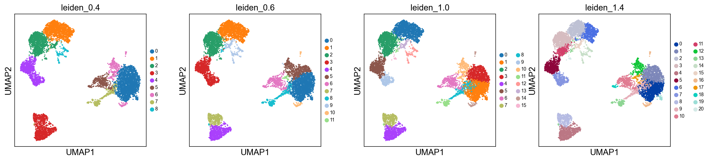
    


Once we have done clustering, the relationships between clusters can be
calculated as correlation in PCA space and we also visualize some of the
marker genes that we used in the Dim Reduction lab onto the clusters. If
we set `dendrogram=True` the clusters are ordered by the dendrogram in
the dotplot.

        using 'X_pca' with n_pcs = 50
    Storing dendrogram info using `.uns['dendrogram_leiden_0.6']`


    
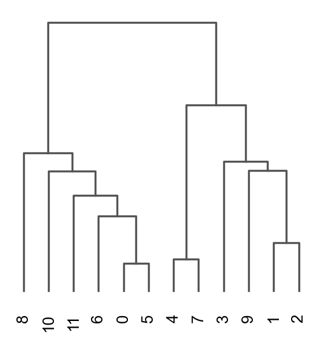
    


    
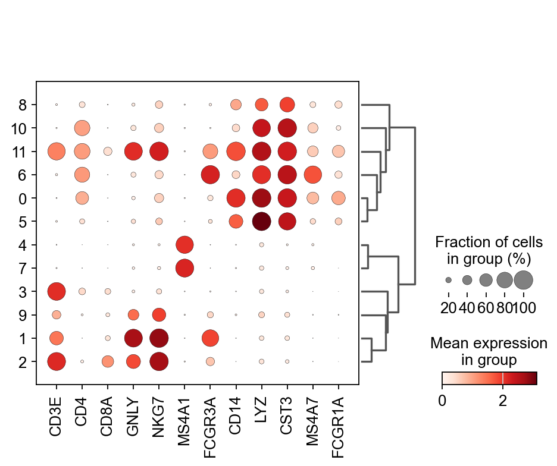
    


## K-means clustering

K-means is a generic clustering algorithm that has been used in many
application areas. In R, it can be applied via the `kmeans()` function.
Typically, it is applied to a reduced dimension representation of the
expression data (most often PCA, because of the interpretability of the
low-dimensional distances). We need to define the number of clusters in
advance. Since the results depend on the initialization of the cluster
centers, it is typically recommended to run K-means with multiple
starting configurations (via the `nstart` argument).


    
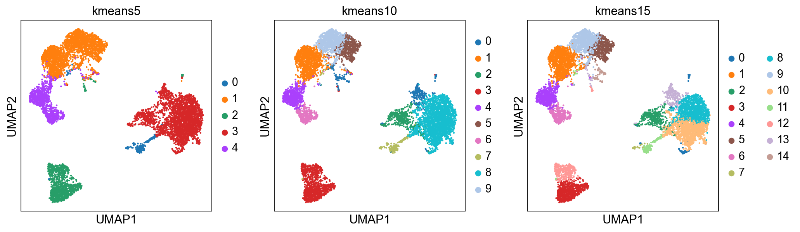
    


    AxisArrays with keys: Scanorama, X_pca, X_pca_combat, X_pca_harmony, X_tsne, X_tsne_bbknn, X_tsne_combat, X_tsne_harmony, X_tsne_scanorama, X_tsne_uncorr, X_umap, X_umap_bbknn, X_umap_combat, X_umap_harmony, X_umap_scanorama, X_umap_uncorr


## Hierarchical clustering

Hierarchical clustering is another generic form of clustering that can
be applied also to scRNA-seq data. As K-means, it is typically applied
to a reduced dimension representation of the data. Hierarchical
clustering returns an entire hierarchy of partitionings (a dendrogram)
that can be cut at different levels. Hierarchical clustering is done in
these steps:

1.  Define the distances between samples. The most common are Euclidean
    distance (a.k.a. straight line between two points) or correlation
    coefficients.
2.  Define a measure of distances between clusters, called *linkage*
    criteria. It can for example be average distances between clusters.
    Commonly used methods are `single`, `complete`, `average`, `median`,
    `centroid` and `ward`.
3.  Define the dendrogram among all samples using **Bottom-up** or
    **Top-down** approach. **Bottom-up** is where samples start with
    their own cluster which end up merged pair-by-pair until only one
    cluster is left. **Top-down** is where samples start all in the same
    cluster that end up being split by 2 until each sample has its own
    cluster.

As you might have realized, correlation is not a method implemented in
the `dist()` function. However, we can create our own distances and
transform them to a distance object. We can first compute sample
correlations using the `cor` function.\
As you already know, correlation range from -1 to 1, where 1 indicates
that two samples are closest, -1 indicates that two samples are the
furthest and 0 is somewhat in between. This, however, creates a problem
in defining distances because a distance of 0 indicates that two samples
are closest, 1 indicates that two samples are the furthest and distance
of -1 is not meaningful. We thus need to transform the correlations to a
positive scale (a.k.a. **adjacency**):\
$$adj = \frac{1- cor}{2}$$\
Once we transformed the correlations to a 0-1 scale, we can simply
convert it to a distance object using `as.dist()` function. The
transformation does not need to have a maximum of 1, but it is more
intuitive to have it at 1, rather than at any other number.

The function `AgglomerativeClustering` has the option of running with
disntance metrics "euclidean", "l1", "l2", "manhattan", "cosine", or
"precomputed". However, with ward linkage only euklidean distances
works. Here we will try out euclidean distance and ward linkage
calculated in PCA space.


    
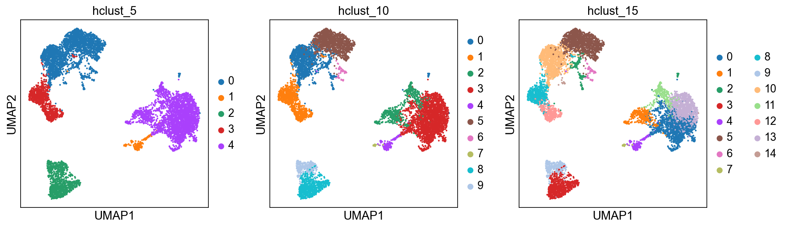
    


Finally, lets save the clustered data for further analysis.

## Distribution of clusters

Now, we can select one of our clustering methods and compare the
proportion of samples across the clusters.

Select the "leiden_0.6" and plot proportion of samples per cluster and
also proportion covid vs ctrl.

Plot proportion of cells from each condition per cluster.


    <matplotlib.legend.Legend at 0x304a790d0>


    
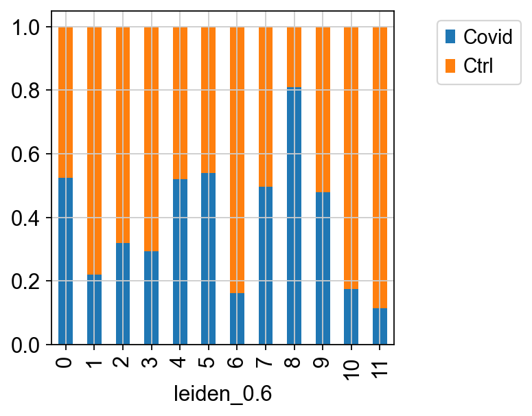
    


    
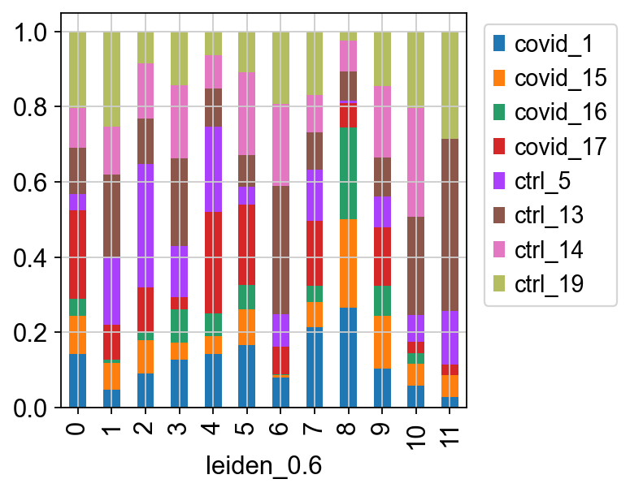
    


In this case we have quite good representation of each sample in each
cluster. But there are clearly some biases with more cells from one
sample in some clusters and also more covid cells in some of the
clusters.

We can also plot it in the other direction, the proportion of each
cluster per sample.


    <matplotlib.legend.Legend at 0x3034cea50>


    
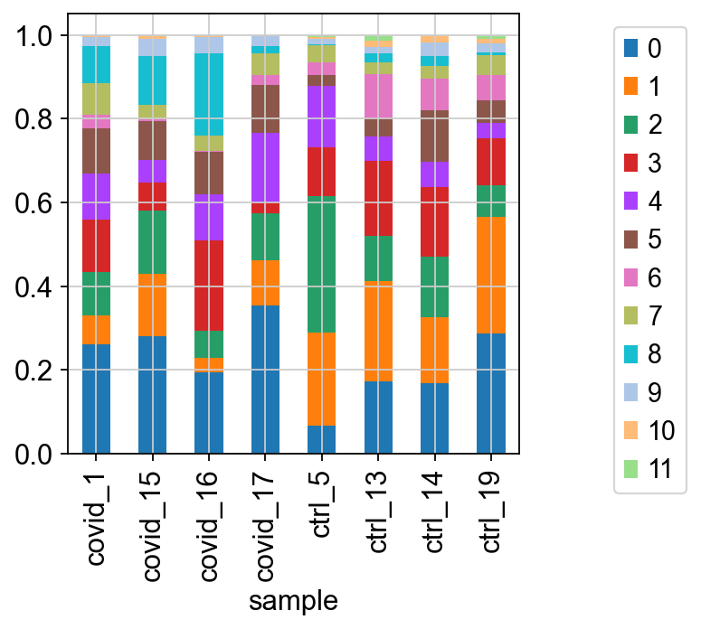
    


<div>

> **Discuss**
>
> By now you should know how to plot different features onto your data.
> Take the QC metrics that were calculated in the first exercise, that
> should be stored in your data object, and plot it as violin plots per
> cluster using the clustering method of your choice. For example, plot
> number of UMIS, detected genes, percent mitochondrial reads. Then,
> check carefully if there is any bias in how your data is separated by
> quality metrics. Could it be explained biologically, or could there be
> a technical bias there?

</div>


    
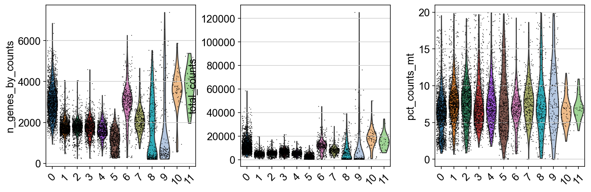
    


Some clusters that are clearly defined by higher number of genes and
counts. These are either doublets or a larger celltype. And some
clusters with low values on these metrics that are either low quality
cells or a smaller celltype. You will have to explore these clusters in
more detail to judge what you believe them to be.

## Subclustering of T and NK-cells

It is common that the subtypes of cells within a cluster is not so well
separated when you have a heterogeneous dataset. In such a case it could
be a good idea to run subclustering of individual celltypes. The main
reason for subclustering is that the variable genes and the first
principal components in the full analysis are mainly driven by
differences between celltypes, while with subclustering we may detect
smaller differences between subtypes within celltypes.

So first, lets find out where our T-cell and NK-cell clusters are. We
know that T-cells express CD3E, and the main subtypes are CD4 and CD8,
while NK-cells express GNLY.


    <Axes: title={'center': 'GNLY'}, xlabel='UMAP1', ylabel='UMAP2'>


    
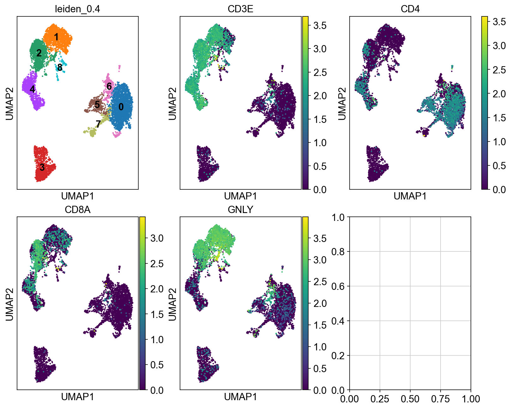
    


We can clearly see what clusters are T-cell clusters, so lets subset the
data for those cells


    sample
    ctrl_5      704
    ctrl_13     624
    ctrl_19     559
    ctrl_14     523
    covid_17    294
    covid_1     287
    covid_15    246
    covid_16    132
    Name: count, dtype: int64


Ideally we should rerun all steps of integration with that subset of
cells instead of just taking the joint embedding. If you have too few
cells per sample in the celltype that you want to cluster it may not be
possible. We will start with selecting a new set of genes that better
reflecs the variability within this celltype

    extracting highly variable genes
        finished (0:00:00)
    --> added
        'highly_variable', boolean vector (adata.var)
        'means', float vector (adata.var)
        'dispersions', float vector (adata.var)
        'dispersions_norm', float vector (adata.var)
    Full data: 1926
    Tcells: 2944
    Intersection: 945


We clearly have a very different geneset now, so hopefully it should
better capture the variability within T-cells.

Now we have to run the full pipeline with scaling, pca, integration and
clustering on this subset of cells, using the new set of variable genes

    regressing out ['total_counts', 'pct_counts_mt']
        sparse input is densified and may lead to high memory use
        finished (0:00:00)
    computing PCA
        with n_comps=50
        finished (0:00:00)


    2025-05-23 17:21:46,836 - harmonypy - INFO - Computing initial centroids with sklearn.KMeans...
    2025-05-23 17:21:47,008 - harmonypy - INFO - sklearn.KMeans initialization complete.
    2025-05-23 17:21:47,015 - harmonypy - INFO - Iteration 1 of 10
    2025-05-23 17:21:47,211 - harmonypy - INFO - Iteration 2 of 10
    2025-05-23 17:21:47,388 - harmonypy - INFO - Iteration 3 of 10
    2025-05-23 17:21:47,571 - harmonypy - INFO - Iteration 4 of 10
    2025-05-23 17:21:47,674 - harmonypy - INFO - Iteration 5 of 10
    2025-05-23 17:21:47,757 - harmonypy - INFO - Iteration 6 of 10
    2025-05-23 17:21:47,827 - harmonypy - INFO - Iteration 7 of 10
    2025-05-23 17:21:47,903 - harmonypy - INFO - Iteration 8 of 10
    2025-05-23 17:21:47,982 - harmonypy - INFO - Iteration 9 of 10
    2025-05-23 17:21:48,053 - harmonypy - INFO - Iteration 10 of 10
    2025-05-23 17:21:48,142 - harmonypy - INFO - Stopped before convergence


    computing neighbors
        finished: added to `.uns['neighbors']`
        `.obsp['distances']`, distances for each pair of neighbors
        `.obsp['connectivities']`, weighted adjacency matrix (0:00:00)
    running Leiden clustering
        finished: found 12 clusters and added
        'tcells_0.6', the cluster labels (adata.obs, categorical) (0:00:00)
    computing UMAP
        finished: added
        'X_umap', UMAP coordinates (adata.obsm)
        'umap', UMAP parameters (adata.uns) (0:00:02)


    <Axes: title={'center': 'Full umap, tcell clust'}, xlabel='X_umap_harmony1', ylabel='X_umap_harmony2'>


    
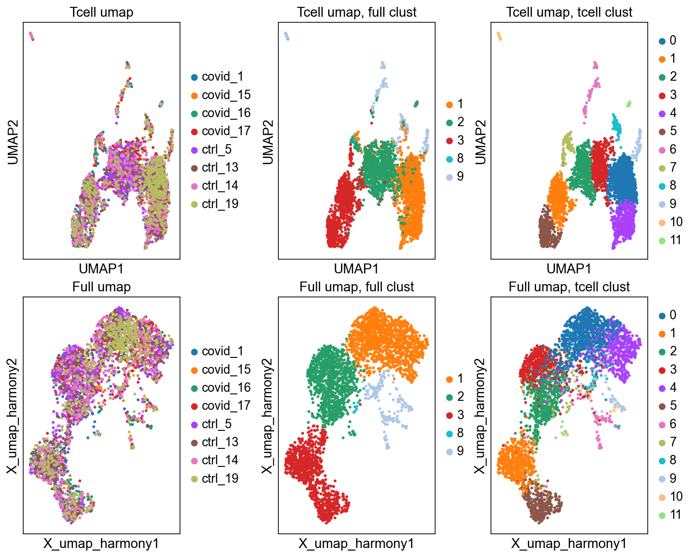
    


As you can see, we do have some new clusters that did not stand out
before. But in general the separation looks very similar.

We can plot the subtype genes again. If you try plotting the genes with
`use_raw=False` you will notice that some of the genes are not in the
`adata.X` matrix. Since they are no longer included in the variable
genes. So now we have to plot with `use_raw=True`.


    <Axes: title={'center': 'GNLY'}, xlabel='UMAP1', ylabel='UMAP2'>


    
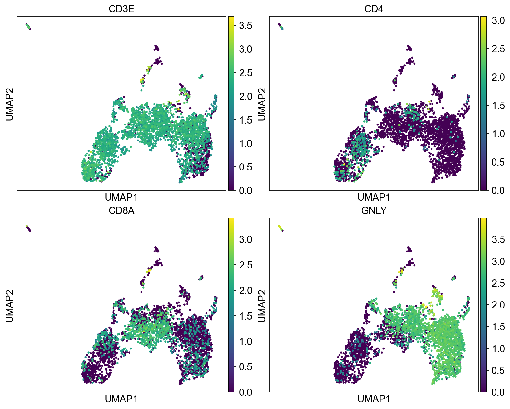
    


<div>

> **Discuss**
>
> Have a look at the T-cells in the umaps with all cells or only T/NK
> cells. What are the main differences? Do you think it improved with
> subclustering? Also, there are some cells in these clusters that fall
> far away from the rest in the UMAPs, why do you think that is?

</div>

## Session info

```{=html}
<details>
```
```{=html}
<summary>
```
Click here
```{=html}
</summary>
```


<table class=table>
            <thead style="position: sticky; top: 0; background-color: var(--jp-layout-color0, var(--vscode-editor-background, white));">
        <tr><th>Package</th><th>Version</th></tr>
    </thead>
    <tbody>
        <tr><td><strong>matplotlib</strong></td><td>3.10.3</td></tr>
        <tr><td><strong>pandas</strong></td><td>2.2.3</td></tr>
        <tr><td><strong>numpy</strong></td><td>2.2.5</td></tr>
        <tr><td><strong>scanpy</strong></td><td>1.11.1</td></tr>
        <tr><td><strong>anndata</strong></td><td>0.11.4</td></tr>
        <tr><td><strong>scikit-learn</strong></td><td>1.5.2</td></tr>
        <tr><td><strong>harmonypy</strong></td><td>0.0.10</td></tr>
    </tbody>
    <thead style="position: sticky; top: 0; background-color: var(--jp-layout-color0, var(--vscode-editor-background, white));">
        <tr><th>Component</th><th>Info</th></tr>
    </thead>
    <tbody>
        <tr><td>Python</td><td>3.12.9 | packaged by Anaconda, Inc. | (main, Feb  6 2025, 12:55:12) [Clang 14.0.6 ]</td></tr>
        <tr><td>OS</td><td>macOS-15.5-arm64-arm-64bit</td></tr>
        <tr><td>CPU</td><td>12 logical CPU cores, arm</td></tr>
        <tr><td>GPU</td><td>No GPU found</td></tr>
        <tr><td>Updated</td><td>2025-05-23 09:21</td></tr>
    </tbody>
        </table>

        <details>
        <summary>Dependencies</summary>
                <div style="max-height: min(500px, 80vh); overflow-y: auto;">
    <table class=table>
            <thead style="position: sticky; top: 0; background-color: var(--jp-layout-color0, var(--vscode-editor-background, white));">
    <tr><th>Dependency</th><th>Version</th></tr>
</thead>
<tbody>
    <tr><td>seaborn</td><td>0.13.2</td></tr>
    <tr><td>tqdm</td><td>4.67.1</td></tr>
    <tr><td>cffi</td><td>1.17.1</td></tr>
    <tr><td>umap-learn</td><td>0.5.7</td></tr>
    <tr><td>jedi</td><td>0.19.2</td></tr>
    <tr><td>stack-data</td><td>0.2.0</td></tr>
    <tr><td>igraph</td><td>0.11.8</td></tr>
    <tr><td>cycler</td><td>0.12.1</td></tr>
    <tr><td>wcwidth</td><td>0.2.5</td></tr>
    <tr><td>leidenalg</td><td>0.10.2</td></tr>
    <tr><td>asttokens</td><td>3.0.0</td></tr>
    <tr><td>appnope</td><td>0.1.3</td></tr>
    <tr><td>patsy</td><td>1.0.1</td></tr>
    <tr><td>h5py</td><td>3.13.0</td></tr>
    <tr><td>Cython</td><td>3.1.0</td></tr>
    <tr><td>kiwisolver</td><td>1.4.8</td></tr>
    <tr><td>parso</td><td>0.8.4</td></tr>
    <tr><td>comm</td><td>0.2.1</td></tr>
    <tr><td>decorator</td><td>5.1.1</td></tr>
    <tr><td>threadpoolctl</td><td>3.6.0</td></tr>
    <tr><td>joblib</td><td>1.5.0</td></tr>
    <tr><td>pyzmq</td><td>26.2.0</td></tr>
    <tr><td>python-dateutil</td><td>2.9.0.post0</td></tr>
    <tr><td>ipykernel</td><td>6.29.5</td></tr>
    <tr><td>pillow</td><td>11.2.1</td></tr>
    <tr><td>numba</td><td>0.61.2</td></tr>
    <tr><td>tornado</td><td>6.4.2</td></tr>
    <tr><td>legacy-api-wrap</td><td>1.4.1</td></tr>
    <tr><td>jupyter_core</td><td>5.7.2</td></tr>
    <tr><td>setuptools</td><td>78.1.1</td></tr>
    <tr><td>PyYAML</td><td>6.0.2</td></tr>
    <tr><td>pure-eval</td><td>0.2.2</td></tr>
    <tr><td>traitlets</td><td>5.14.3</td></tr>
    <tr><td>debugpy</td><td>1.8.11</td></tr>
    <tr><td>Pygments</td><td>2.19.1</td></tr>
    <tr><td>natsort</td><td>8.4.0</td></tr>
    <tr><td>psutil</td><td>5.9.0</td></tr>
    <tr><td>typing_extensions</td><td>4.12.2</td></tr>
    <tr><td>matplotlib-inline</td><td>0.1.6</td></tr>
    <tr><td>executing</td><td>0.8.3</td></tr>
    <tr><td>session-info2</td><td>0.1.2</td></tr>
    <tr><td>prompt-toolkit</td><td>3.0.43</td></tr>
    <tr><td>platformdirs</td><td>4.3.7</td></tr>
    <tr><td>packaging</td><td>24.2</td></tr>
    <tr><td>pynndescent</td><td>0.5.13</td></tr>
    <tr><td>charset-normalizer</td><td>3.3.2</td></tr>
    <tr><td>statsmodels</td><td>0.14.4</td></tr>
    <tr><td>ipython</td><td>9.1.0</td></tr>
    <tr><td>six</td><td>1.17.0</td></tr>
    <tr><td>defusedxml</td><td>0.7.1</td></tr>
    <tr><td>llvmlite</td><td>0.44.0</td></tr>
    <tr><td>pycparser</td><td>2.21</td></tr>
    <tr><td>pyparsing</td><td>3.2.3</td></tr>
    <tr><td>pytz</td><td>2025.2</td></tr>
    <tr><td>texttable</td><td>1.7.0</td></tr>
    <tr><td>scipy</td><td>1.15.3</td></tr>
    <tr><td>jupyter_client</td><td>8.6.3</td></tr>
</tbody>
    </table>
</div>
    </details>
        <details>
            <summary>Copyable Markdown</summary>
            <pre>| Package      | Version |
| ------------ | ------- |
| matplotlib   | 3.10.3  |
| pandas       | 2.2.3   |
| numpy        | 2.2.5   |
| scanpy       | 1.11.1  |
| anndata      | 0.11.4  |
| scikit-learn | 1.5.2   |
| harmonypy    | 0.0.10  |

| Dependency         | Version     |
| ------------------ | ----------- |
| seaborn            | 0.13.2      |
| tqdm               | 4.67.1      |
| cffi               | 1.17.1      |
| umap-learn         | 0.5.7       |
| jedi               | 0.19.2      |
| stack-data         | 0.2.0       |
| igraph             | 0.11.8      |
| cycler             | 0.12.1      |
| wcwidth            | 0.2.5       |
| leidenalg          | 0.10.2      |
| asttokens          | 3.0.0       |
| appnope            | 0.1.3       |
| patsy              | 1.0.1       |
| h5py               | 3.13.0      |
| Cython             | 3.1.0       |
| kiwisolver         | 1.4.8       |
| parso              | 0.8.4       |
| comm               | 0.2.1       |
| decorator          | 5.1.1       |
| threadpoolctl      | 3.6.0       |
| joblib             | 1.5.0       |
| pyzmq              | 26.2.0      |
| python-dateutil    | 2.9.0.post0 |
| ipykernel          | 6.29.5      |
| pillow             | 11.2.1      |
| numba              | 0.61.2      |
| tornado            | 6.4.2       |
| legacy-api-wrap    | 1.4.1       |
| jupyter_core       | 5.7.2       |
| setuptools         | 78.1.1      |
| PyYAML             | 6.0.2       |
| pure-eval          | 0.2.2       |
| traitlets          | 5.14.3      |
| debugpy            | 1.8.11      |
| Pygments           | 2.19.1      |
| natsort            | 8.4.0       |
| psutil             | 5.9.0       |
| typing_extensions  | 4.12.2      |
| matplotlib-inline  | 0.1.6       |
| executing          | 0.8.3       |
| session-info2      | 0.1.2       |
| prompt-toolkit     | 3.0.43      |
| platformdirs       | 4.3.7       |
| packaging          | 24.2        |
| pynndescent        | 0.5.13      |
| charset-normalizer | 3.3.2       |
| statsmodels        | 0.14.4      |
| ipython            | 9.1.0       |
| six                | 1.17.0      |
| defusedxml         | 0.7.1       |
| llvmlite           | 0.44.0      |
| pycparser          | 2.21        |
| pyparsing          | 3.2.3       |
| pytz               | 2025.2      |
| texttable          | 1.7.0       |
| scipy              | 1.15.3      |
| jupyter_client     | 8.6.3       |

| Component | Info                                                                                |
| --------- | ----------------------------------------------------------------------------------- |
| Python    | 3.12.9 | packaged by Anaconda, Inc. | (main, Feb  6 2025, 12:55:12) [Clang 14.0.6 ] |
| OS        | macOS-15.5-arm64-arm-64bit                                                          |
| CPU       | 12 logical CPU cores, arm                                                           |
| GPU       | No GPU found                                                                        |
| Updated   | 2025-05-23 09:21                                                                    |</pre>
        </details>


```{=html}
</details>
```

## arch
