<div>

> **Note**
>
> Code chunks run Python commands unless it starts with `%%bash`, in
> which case, those chunks run shell commands.

</div>

Celltype prediction can either be performed on indiviudal cells where
each cell gets a predicted celltype label, or on the level of clusters.
All methods are based on similarity to other datasets, single cell or
sorted bulk RNAseq, or uses known marker genes for each cell type.\
Ideally celltype predictions should be run on each sample separately and
not using the integrated data. In this case we will select one sample
from the Covid data, `ctrl_13` and predict celltype by cell on that
sample.\
Some methods will predict a celltype to each cell based on what it is
most similar to, even if that celltype is not included in the reference.
Other methods include an uncertainty so that cells with low similarity
scores will be unclassified.\
There are multiple different methods to predict celltypes, here we will
just cover a few of those.

Here we will use a reference PBMC dataset that we get from scanpy
datasets and classify celltypes based on two methods:

-   Using scanorama for integration just as in the integration lab, and
    then do label transfer based on closest neighbors.
-   Using ingest to project the data onto the reference data and
    transfer labels.
-   Using Celltypist to predicted with a pretrained pbmc model or with
    an own model based on the same reference data as the other methods.

First, lets load required libraries

Let's read in the saved Covid-19 data object from the clustering step.


    AnnData object with n_obs × n_vars = 7332 × 3984
        obs: 'type', 'sample', 'batch', 'n_genes_by_counts', 'total_counts', 'total_counts_mt', 'pct_counts_mt', 'total_counts_ribo', 'pct_counts_ribo', 'total_counts_hb', 'pct_counts_hb', 'percent_mt2', 'n_counts', 'n_genes', 'percent_chrY', 'XIST-counts', 'S_score', 'G2M_score', 'phase', 'doublet_scores', 'predicted_doublets', 'doublet_info', 'leiden', 'leiden_0.4', 'leiden_0.6', 'leiden_1.0', 'leiden_1.4', 'kmeans5', 'kmeans10', 'kmeans15', 'hclust_5', 'hclust_10', 'hclust_15'
        var: 'gene_ids', 'feature_types', 'genome', 'mt', 'ribo', 'hb', 'n_cells_by_counts', 'mean_counts', 'pct_dropout_by_counts', 'total_counts', 'n_cells', 'highly_variable', 'means', 'dispersions', 'dispersions_norm', 'highly_variable_nbatches', 'highly_variable_intersection', 'mean', 'std'
        uns: 'dendrogram_leiden_0.6', 'doublet_info_colors', 'hclust_10_colors', 'hclust_15_colors', 'hclust_5_colors', 'hvg', 'kmeans10_colors', 'kmeans15_colors', 'kmeans5_colors', 'leiden', 'leiden_0.4', 'leiden_0.4_colors', 'leiden_0.6', 'leiden_0.6_colors', 'leiden_1.0', 'leiden_1.0_colors', 'leiden_1.4', 'leiden_1.4_colors', 'log1p', 'neighbors', 'pca', 'phase_colors', 'sample_colors', 'tsne', 'umap'
        obsm: 'Scanorama', 'X_pca', 'X_pca_combat', 'X_pca_harmony', 'X_tsne', 'X_tsne_bbknn', 'X_tsne_combat', 'X_tsne_harmony', 'X_tsne_scanorama', 'X_tsne_uncorr', 'X_umap', 'X_umap_bbknn', 'X_umap_combat', 'X_umap_harmony', 'X_umap_scanorama', 'X_umap_uncorr'
        varm: 'PCs'
        obsp: 'connectivities', 'distances'


    (7332, 3984)
    (7332, 19468)


Subset one patient.

    (1154, 19468)


    leiden_0.6
    1     276
    3     207
    0     200
    6     124
    2     123
    4      68
    5      49
    7      32
    8      23
    9      18
    10     18
    11     16
    Name: count, dtype: int64


Some clusters have very few cells from this individual, so any cluster
comparisons may be biased by this.


    
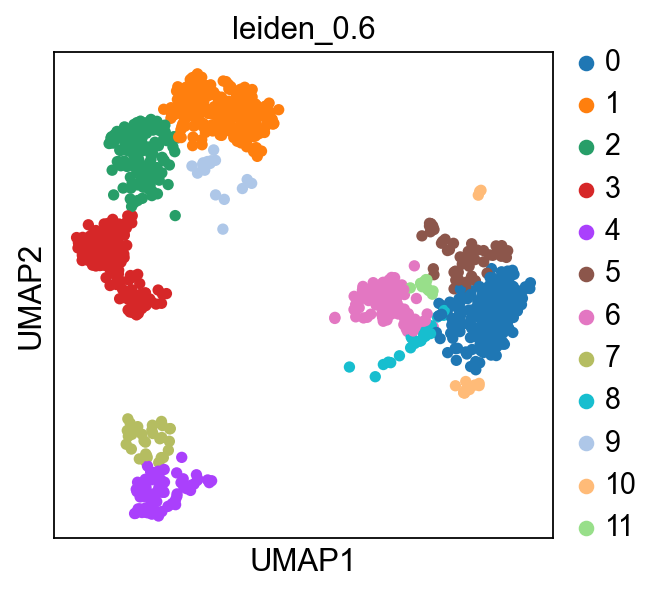
    


## Reference data

Load the reference data from `scanpy.datasets`. It is the annotated and
processed pbmc3k dataset from 10x.

    (2638, 1838)


<div>
<style scoped>
    .dataframe tbody tr th:only-of-type {
        vertical-align: middle;
    }

    .dataframe tbody tr th {
        vertical-align: top;
    }

    .dataframe thead th {
        text-align: right;
    }
</style>
<table border="1" class="dataframe">
  <thead>
    <tr style="text-align: right;">
      <th></th>
      <th>n_genes</th>
      <th>percent_mito</th>
      <th>n_counts</th>
      <th>louvain</th>
      <th>sample</th>
    </tr>
    <tr>
      <th>index</th>
      <th></th>
      <th></th>
      <th></th>
      <th></th>
      <th></th>
    </tr>
  </thead>
  <tbody>
    <tr>
      <th>AAACATACAACCAC-1</th>
      <td>781</td>
      <td>0.030178</td>
      <td>2419.0</td>
      <td>CD4 T cells</td>
      <td>pbmc3k</td>
    </tr>
    <tr>
      <th>AAACATTGAGCTAC-1</th>
      <td>1352</td>
      <td>0.037936</td>
      <td>4903.0</td>
      <td>B cells</td>
      <td>pbmc3k</td>
    </tr>
    <tr>
      <th>AAACATTGATCAGC-1</th>
      <td>1131</td>
      <td>0.008897</td>
      <td>3147.0</td>
      <td>CD4 T cells</td>
      <td>pbmc3k</td>
    </tr>
    <tr>
      <th>AAACCGTGCTTCCG-1</th>
      <td>960</td>
      <td>0.017431</td>
      <td>2639.0</td>
      <td>CD14+ Monocytes</td>
      <td>pbmc3k</td>
    </tr>
    <tr>
      <th>AAACCGTGTATGCG-1</th>
      <td>522</td>
      <td>0.012245</td>
      <td>980.0</td>
      <td>NK cells</td>
      <td>pbmc3k</td>
    </tr>
    <tr>
      <th>...</th>
      <td>...</td>
      <td>...</td>
      <td>...</td>
      <td>...</td>
      <td>...</td>
    </tr>
    <tr>
      <th>TTTCGAACTCTCAT-1</th>
      <td>1155</td>
      <td>0.021104</td>
      <td>3459.0</td>
      <td>CD14+ Monocytes</td>
      <td>pbmc3k</td>
    </tr>
    <tr>
      <th>TTTCTACTGAGGCA-1</th>
      <td>1227</td>
      <td>0.009294</td>
      <td>3443.0</td>
      <td>B cells</td>
      <td>pbmc3k</td>
    </tr>
    <tr>
      <th>TTTCTACTTCCTCG-1</th>
      <td>622</td>
      <td>0.021971</td>
      <td>1684.0</td>
      <td>B cells</td>
      <td>pbmc3k</td>
    </tr>
    <tr>
      <th>TTTGCATGAGAGGC-1</th>
      <td>454</td>
      <td>0.020548</td>
      <td>1022.0</td>
      <td>B cells</td>
      <td>pbmc3k</td>
    </tr>
    <tr>
      <th>TTTGCATGCCTCAC-1</th>
      <td>724</td>
      <td>0.008065</td>
      <td>1984.0</td>
      <td>CD4 T cells</td>
      <td>pbmc3k</td>
    </tr>
  </tbody>
</table>
<p>2638 rows × 5 columns</p>
</div>


As you can see, the celltype annotation is in the metadata column
`louvain`, so that is the column we will have to use for classification.


    
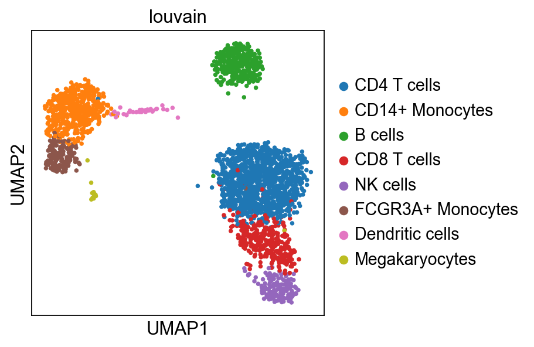
    


Make sure we have the same genes in both datset by taking the
intersection

    1838
    19468
    1676


First we need to rerun pca and umap with the same gene set for both
datasets.

    computing PCA
        with n_comps=50
        finished (0:00:00)
    computing neighbors
        using 'X_pca' with n_pcs = 50
        finished (0:00:01)
    computing UMAP
        finished (0:00:02)


    
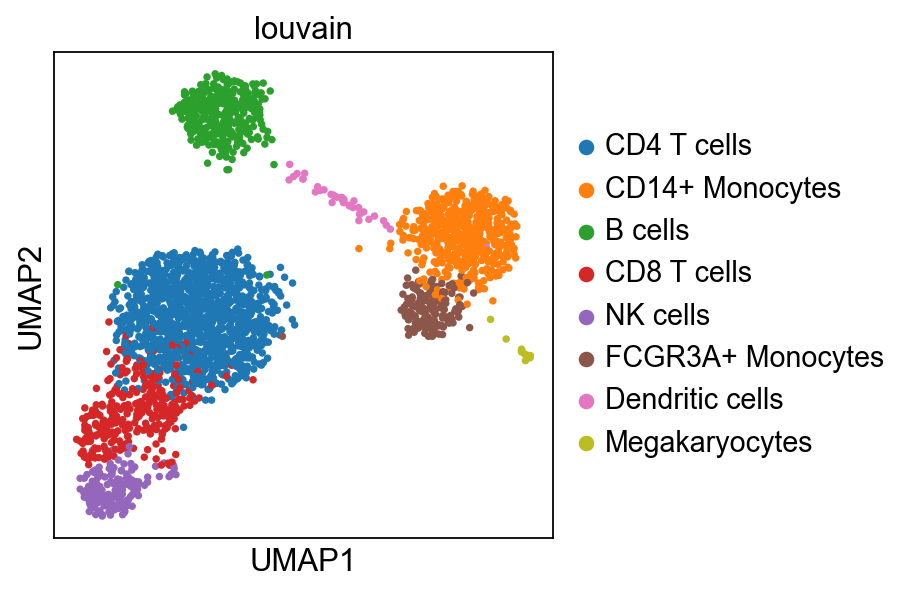
    


    computing PCA
        with n_comps=50
        finished (0:00:00)
    computing neighbors
        using 'X_pca' with n_pcs = 50
        finished (0:00:00)
    computing UMAP
        finished (0:00:00)


    
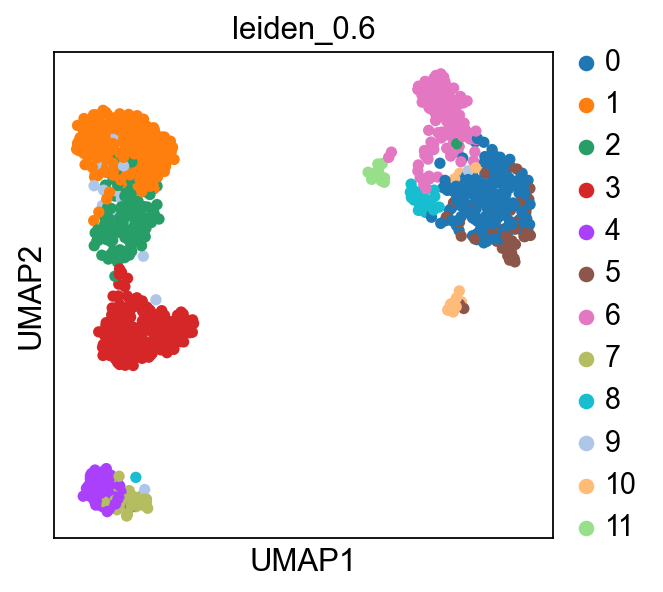
    


## Integrate with scanorama

    Found 1676 genes among all datasets
    [[0.         0.43067591]
     [0.         0.        ]]
    Processing datasets (0, 1)


    WARNING: Oversmoothing detected, refusing to batch correct, consider lowering sigma value.


    computing neighbors
        finished (0:00:00)
    computing UMAP
        finished (0:00:02)


    
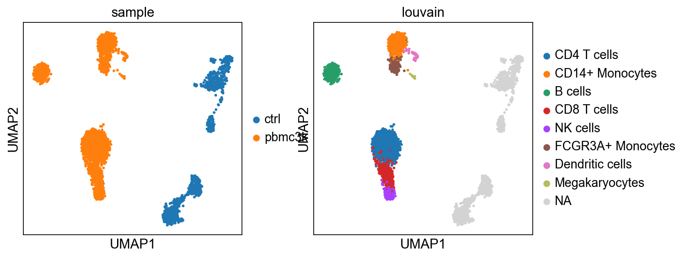
    


### Label transfer

Using the functions from the [Spatial
tutorial](https://scanpy.readthedocs.io/en/stable/tutorials/spatial/integration-scanorama.html)
from Scanpy we will calculate normalized cosine distances between the
two datasets and tranfer labels to the celltype with the highest scores.


    
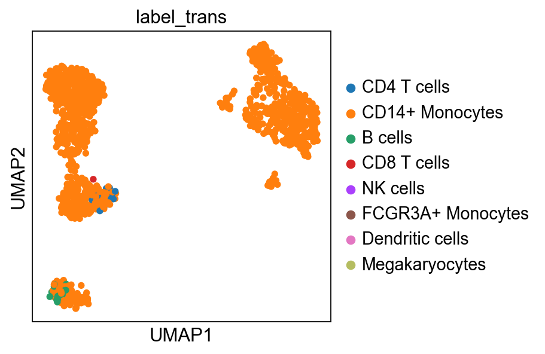
    


    
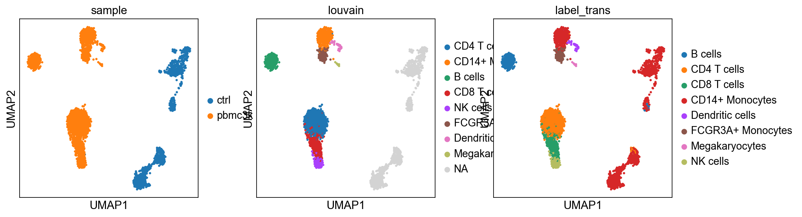
    


    
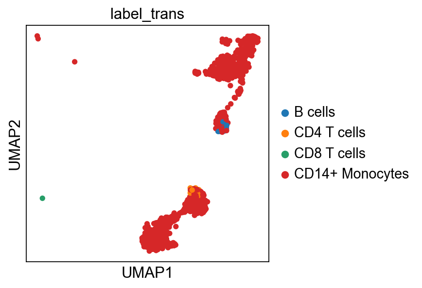
    


Now plot how many cells of each celltypes can be found in each cluster.


    <matplotlib.legend.Legend at 0x337785190>


    
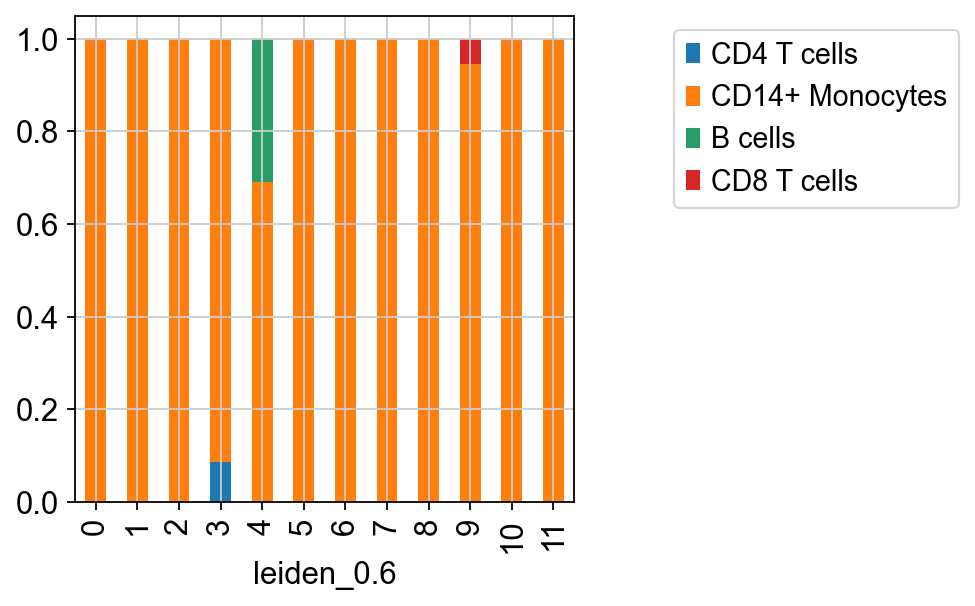
    


## Ingest

Another method for celltype prediction is Ingest, for more information,
please look at
https://scanpy-tutorials.readthedocs.io/en/latest/integrating-data-using-ingest.html

    running ingest
        finished (0:00:07)


    
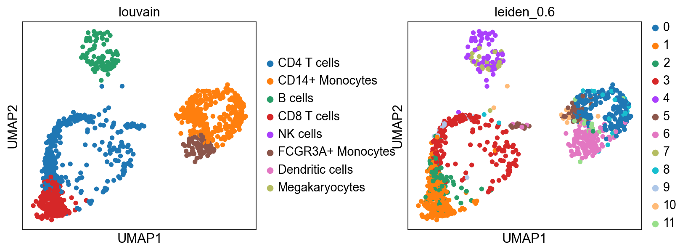
    


As you can see, ingest has created a new umap for us, so to get
consistent plotting, lets revert back to the old one for further
plotting:


    
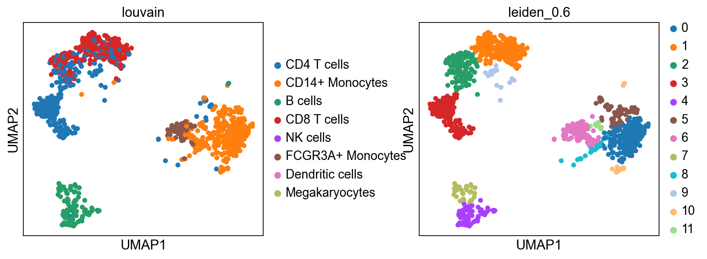
    


Now plot how many cells of each celltypes can be found in each cluster.


    <matplotlib.legend.Legend at 0x350f85670>


    
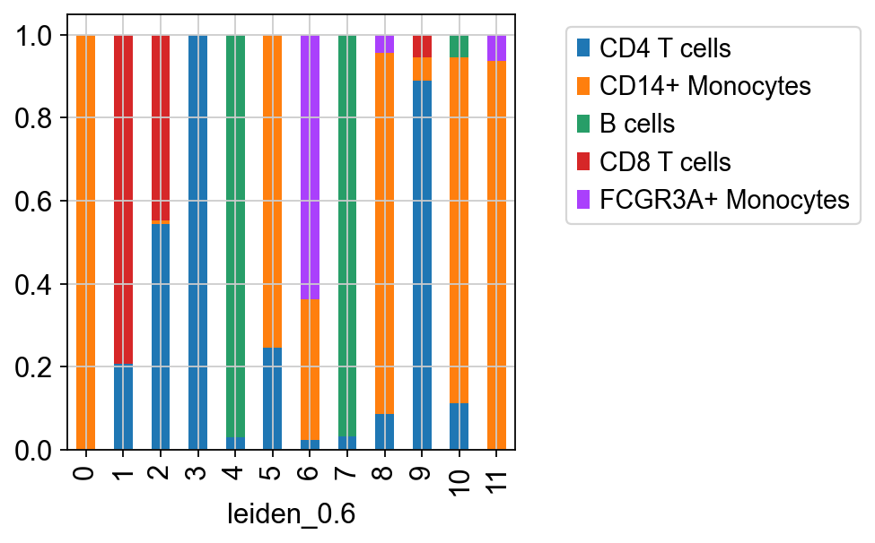
    


## Celltypist

[Celltypist](https://www.celltypist.org/) provides pretrained models for
classification for many different human tissues and celltypes. Here, we
are following the steps of this
[tutorial](https://colab.research.google.com/github/Teichlab/celltypist/blob/main/docs/notebook/celltypist_tutorial.ipynb),
with some adaptations for this dataset. So please check out the tutorial
for more detail.

    📂 Storing models in /Users/daweihuang/.celltypist/data/models
    💾 Total models to download: 1
    ⏩ Skipping [1/1]: Immune_All_Low.pkl (file exists)
    📂 Storing models in /Users/daweihuang/.celltypist/data/models
    💾 Total models to download: 1
    ⏩ Skipping [1/1]: Immune_All_High.pkl (file exists)


Now select the model you want to use and show the info:


    CellTypist model with 32 cell types and 6639 features
        date: 2022-07-16 08:53:00.959521
        details: immune populations combined from 20 tissues of 18 studies
        source: https://doi.org/10.1126/science.abl5197
        version: v2
        cell types: B cells, B-cell lineage, ..., pDC precursor
        features: A1BG, A2M, ..., ZYX


To infer celltype labels to our cells, we first need to convert back to
the full matrix. OBS! For celltypist we want to have log1p normalised
expression to 10,000 counts per cell. Which we already have in
`adata.raw.X`, check by summing up the data, it should sum to 10K.


    matrix([[10000.],
            [10000.],
            [10000.],
            [10000.],
            [10000.],
            [10000.],
            [10000.],
            [10000.],
            [10000.],
            [10000.]])


    🔬 Input data has 1154 cells and 19468 genes
    🔗 Matching reference genes in the model
    🧬 5460 features used for prediction
    ⚖️ Scaling input data
    🖋️ Predicting labels
    ✅ Prediction done!
    👀 Detected a neighborhood graph in the input object, will run over-clustering on the basis of it
    ⛓️ Over-clustering input data with resolution set to 5


    running Leiden clustering
        finished (0:00:00)


    🗳️ Majority voting the predictions
    ✅ Majority voting done!


<div>
<style scoped>
    .dataframe tbody tr th:only-of-type {
        vertical-align: middle;
    }

    .dataframe tbody tr th {
        vertical-align: top;
    }

    .dataframe thead th {
        text-align: right;
    }
</style>
<table border="1" class="dataframe">
  <thead>
    <tr style="text-align: right;">
      <th></th>
      <th>predicted_labels</th>
      <th>over_clustering</th>
      <th>majority_voting</th>
    </tr>
  </thead>
  <tbody>
    <tr>
      <th>AGGTCATGTGCGAACA-13-5</th>
      <td>T cells</td>
      <td>15</td>
      <td>T cells</td>
    </tr>
    <tr>
      <th>CCTATCGGTCCCTCAT-13-5</th>
      <td>ILC</td>
      <td>18</td>
      <td>ILC</td>
    </tr>
    <tr>
      <th>TCCTCCCTCGTTCATT-13-5</th>
      <td>HSC/MPP</td>
      <td>23</td>
      <td>ILC</td>
    </tr>
    <tr>
      <th>CAACCAATCATCTATC-13-5</th>
      <td>ILC</td>
      <td>18</td>
      <td>ILC</td>
    </tr>
    <tr>
      <th>TACGGTATCGGATTAC-13-5</th>
      <td>T cells</td>
      <td>5</td>
      <td>T cells</td>
    </tr>
    <tr>
      <th>...</th>
      <td>...</td>
      <td>...</td>
      <td>...</td>
    </tr>
    <tr>
      <th>TCCACCATCATAGCAC-13-5</th>
      <td>T cells</td>
      <td>15</td>
      <td>T cells</td>
    </tr>
    <tr>
      <th>GAGTTACAGTGAGTGC-13-5</th>
      <td>T cells</td>
      <td>11</td>
      <td>T cells</td>
    </tr>
    <tr>
      <th>ATCATTCAGGCTCACC-13-5</th>
      <td>Monocytes</td>
      <td>20</td>
      <td>Monocytes</td>
    </tr>
    <tr>
      <th>AGCCACGCAACCCTAA-13-5</th>
      <td>T cells</td>
      <td>0</td>
      <td>T cells</td>
    </tr>
    <tr>
      <th>CTACCTGGTCAGGAGT-13-5</th>
      <td>ILC</td>
      <td>32</td>
      <td>ILC</td>
    </tr>
  </tbody>
</table>
<p>1154 rows × 3 columns</p>
</div>


The first column `predicted_labels` is the predictions made for each
individual cell, while `majority_voting` is done for local subclusters,
the clustering identities are in column `over_clustering`.

Now we convert the predictions to an anndata object.


    
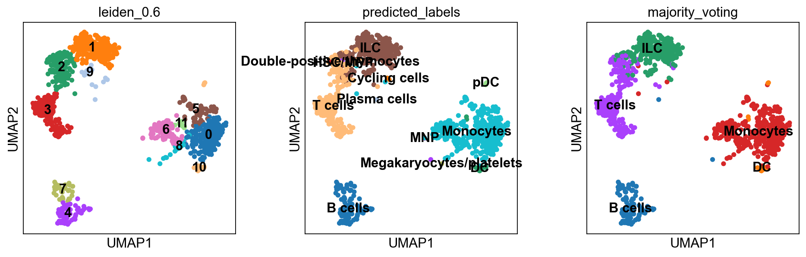
    


<div>

> **Task**
>
> Rerun predictions with Celltypist, but use another model, for instance
> `Immune_All_High.pkl`, or any other model you find relevant, you can
> find a list of models [here](https://www.celltypist.org/models). How
> do the results differ for you?

</div>

### Celltypist custom model

We can also train our own model on any reference data that we want to
use. In this case we will use the pbmc data in `adata_ref` to train a
model.

Celltypist requires the data to be in the format of log1p normalised
expression to 10,000 counts per cell, we can check if that is the case
for the object we have:


    matrix([[2419.],
            [4903.],
            [3147.],
            [2639.],
            [ 980.],
            [2163.],
            [2175.],
            [2260.],
            [1275.],
            [1103.]], dtype=float32)


These should all sum up to 10K, which is not the case, probably since
some genes were removed after normalizing. Wo we will have to start from
the raw counts of that dataset instead. Before we selected the data
`pbmc3k_processed`, but now we will instead use `pbmc3k`.


    AnnData object with n_obs × n_vars = 2700 × 32738
        var: 'gene_ids'


This data is not annotated, so we will have to match the indices from
the filtered and processed object. And add in the metadata with
annotations.


    AnnData object with n_obs × n_vars = 2638 × 32738
        obs: 'n_genes', 'percent_mito', 'n_counts', 'louvain', 'sample'
        var: 'gene_ids'


Now we can normalize the matrix:

    normalizing counts per cell
        finished (0:00:00)


    matrix([[10000.   ],
            [ 9999.999],
            [10000.   ],
            [ 9999.998],
            [ 9999.998],
            [10000.   ],
            [ 9999.999],
            [10000.   ],
            [10000.001],
            [10000.   ]], dtype=float32)


And finally train the model.

    🍳 Preparing data before training
    ✂️ 16159 non-expressed genes are filtered out
    🔬 Input data has 2638 cells and 16579 genes
    ⚖️ Scaling input data
    🏋️ Training data using SGD logistic regression
    🔎 Selecting features
    🧬 2047 features are selected
    🏋️ Starting the second round of training
    🏋️ Training data using logistic regression
    /opt/anaconda3/envs/scanpy/lib/python3.12/site-packages/sklearn/linear_model/_linear_loss.py:165: RuntimeWarning: divide by zero encountered in matmul
      raw_prediction = X @ weights + intercept
    /opt/anaconda3/envs/scanpy/lib/python3.12/site-packages/sklearn/linear_model/_linear_loss.py:165: RuntimeWarning: overflow encountered in matmul
      raw_prediction = X @ weights + intercept
    /opt/anaconda3/envs/scanpy/lib/python3.12/site-packages/sklearn/linear_model/_linear_loss.py:165: RuntimeWarning: divide by zero encountered in matmul
      raw_prediction = X @ weights + intercept
    /opt/anaconda3/envs/scanpy/lib/python3.12/site-packages/sklearn/linear_model/_linear_loss.py:165: RuntimeWarning: invalid value encountered in matmul
      raw_prediction = X @ weights + intercept
    /opt/anaconda3/envs/scanpy/lib/python3.12/site-packages/sklearn/linear_model/_linear_loss.py:165: RuntimeWarning: divide by zero encountered in matmul
      raw_prediction = X @ weights + intercept
    /opt/anaconda3/envs/scanpy/lib/python3.12/site-packages/sklearn/linear_model/_linear_loss.py:165: RuntimeWarning: divide by zero encountered in matmul
      raw_prediction = X @ weights + intercept
    /opt/anaconda3/envs/scanpy/lib/python3.12/site-packages/sklearn/linear_model/_linear_loss.py:165: RuntimeWarning: overflow encountered in matmul
      raw_prediction = X @ weights + intercept
    /opt/anaconda3/envs/scanpy/lib/python3.12/site-packages/sklearn/linear_model/_linear_loss.py:165: RuntimeWarning: invalid value encountered in matmul
      raw_prediction = X @ weights + intercept
    /opt/anaconda3/envs/scanpy/lib/python3.12/site-packages/sklearn/linear_model/_linear_loss.py:165: RuntimeWarning: divide by zero encountered in matmul
      raw_prediction = X @ weights + intercept
    /opt/anaconda3/envs/scanpy/lib/python3.12/site-packages/sklearn/linear_model/_linear_loss.py:165: RuntimeWarning: overflow encountered in matmul
      raw_prediction = X @ weights + intercept
    /opt/anaconda3/envs/scanpy/lib/python3.12/site-packages/sklearn/linear_model/_linear_loss.py:165: RuntimeWarning: overflow encountered in matmul
      raw_prediction = X @ weights + intercept
    /opt/anaconda3/envs/scanpy/lib/python3.12/site-packages/sklearn/linear_model/_linear_loss.py:165: RuntimeWarning: invalid value encountered in matmul
      raw_prediction = X @ weights + intercept
    /opt/anaconda3/envs/scanpy/lib/python3.12/site-packages/sklearn/linear_model/_linear_loss.py:165: RuntimeWarning: invalid value encountered in matmul
      raw_prediction = X @ weights + intercept
    /opt/anaconda3/envs/scanpy/lib/python3.12/site-packages/sklearn/linear_model/_linear_loss.py:165: RuntimeWarning: overflow encountered in matmul
      raw_prediction = X @ weights + intercept
    /opt/anaconda3/envs/scanpy/lib/python3.12/site-packages/sklearn/linear_model/_linear_loss.py:165: RuntimeWarning: invalid value encountered in matmul
      raw_prediction = X @ weights + intercept
    /opt/anaconda3/envs/scanpy/lib/python3.12/site-packages/sklearn/linear_model/_linear_loss.py:165: RuntimeWarning: divide by zero encountered in matmul
      raw_prediction = X @ weights + intercept
    /opt/anaconda3/envs/scanpy/lib/python3.12/site-packages/sklearn/linear_model/_linear_loss.py:165: RuntimeWarning: overflow encountered in matmul
      raw_prediction = X @ weights + intercept
    /opt/anaconda3/envs/scanpy/lib/python3.12/site-packages/sklearn/linear_model/_linear_loss.py:165: RuntimeWarning: invalid value encountered in matmul
      raw_prediction = X @ weights + intercept
    /opt/anaconda3/envs/scanpy/lib/python3.12/site-packages/sklearn/linear_model/_linear_loss.py:165: RuntimeWarning: divide by zero encountered in matmul
      raw_prediction = X @ weights + intercept
    /opt/anaconda3/envs/scanpy/lib/python3.12/site-packages/sklearn/linear_model/_linear_loss.py:165: RuntimeWarning: overflow encountered in matmul
      raw_prediction = X @ weights + intercept
    /opt/anaconda3/envs/scanpy/lib/python3.12/site-packages/sklearn/linear_model/_linear_loss.py:165: RuntimeWarning: invalid value encountered in matmul
      raw_prediction = X @ weights + intercept
    /opt/anaconda3/envs/scanpy/lib/python3.12/site-packages/sklearn/linear_model/_linear_loss.py:174: RuntimeWarning: divide by zero encountered in matmul
      norm2_w = weights @ weights if weights.ndim == 1 else squared_norm(weights)
    /opt/anaconda3/envs/scanpy/lib/python3.12/site-packages/sklearn/linear_model/_linear_loss.py:174: RuntimeWarning: overflow encountered in matmul
      norm2_w = weights @ weights if weights.ndim == 1 else squared_norm(weights)
    /opt/anaconda3/envs/scanpy/lib/python3.12/site-packages/sklearn/linear_model/_linear_loss.py:174: RuntimeWarning: invalid value encountered in matmul
      norm2_w = weights @ weights if weights.ndim == 1 else squared_norm(weights)
    /opt/anaconda3/envs/scanpy/lib/python3.12/site-packages/sklearn/linear_model/_linear_loss.py:174: RuntimeWarning: divide by zero encountered in matmul
      norm2_w = weights @ weights if weights.ndim == 1 else squared_norm(weights)
    /opt/anaconda3/envs/scanpy/lib/python3.12/site-packages/sklearn/linear_model/_linear_loss.py:174: RuntimeWarning: divide by zero encountered in matmul
      norm2_w = weights @ weights if weights.ndim == 1 else squared_norm(weights)
    /opt/anaconda3/envs/scanpy/lib/python3.12/site-packages/sklearn/linear_model/_linear_loss.py:174: RuntimeWarning: overflow encountered in matmul
      norm2_w = weights @ weights if weights.ndim == 1 else squared_norm(weights)
    /opt/anaconda3/envs/scanpy/lib/python3.12/site-packages/sklearn/linear_model/_linear_loss.py:174: RuntimeWarning: invalid value encountered in matmul
      norm2_w = weights @ weights if weights.ndim == 1 else squared_norm(weights)
    /opt/anaconda3/envs/scanpy/lib/python3.12/site-packages/sklearn/linear_model/_linear_loss.py:174: RuntimeWarning: overflow encountered in matmul
      norm2_w = weights @ weights if weights.ndim == 1 else squared_norm(weights)
    /opt/anaconda3/envs/scanpy/lib/python3.12/site-packages/sklearn/linear_model/_linear_loss.py:174: RuntimeWarning: invalid value encountered in matmul
      norm2_w = weights @ weights if weights.ndim == 1 else squared_norm(weights)
    /opt/anaconda3/envs/scanpy/lib/python3.12/site-packages/sklearn/linear_model/_linear_loss.py:174: RuntimeWarning: divide by zero encountered in matmul
      norm2_w = weights @ weights if weights.ndim == 1 else squared_norm(weights)
    /opt/anaconda3/envs/scanpy/lib/python3.12/site-packages/sklearn/linear_model/_linear_loss.py:174: RuntimeWarning: overflow encountered in matmul
      norm2_w = weights @ weights if weights.ndim == 1 else squared_norm(weights)
    /opt/anaconda3/envs/scanpy/lib/python3.12/site-packages/sklearn/linear_model/_linear_loss.py:174: RuntimeWarning: invalid value encountered in matmul
      norm2_w = weights @ weights if weights.ndim == 1 else squared_norm(weights)
    /opt/anaconda3/envs/scanpy/lib/python3.12/site-packages/sklearn/linear_model/_linear_loss.py:174: RuntimeWarning: divide by zero encountered in matmul
      norm2_w = weights @ weights if weights.ndim == 1 else squared_norm(weights)
    /opt/anaconda3/envs/scanpy/lib/python3.12/site-packages/sklearn/linear_model/_linear_loss.py:174: RuntimeWarning: overflow encountered in matmul
      norm2_w = weights @ weights if weights.ndim == 1 else squared_norm(weights)
    /opt/anaconda3/envs/scanpy/lib/python3.12/site-packages/sklearn/linear_model/_linear_loss.py:174: RuntimeWarning: invalid value encountered in matmul
      norm2_w = weights @ weights if weights.ndim == 1 else squared_norm(weights)
    /opt/anaconda3/envs/scanpy/lib/python3.12/site-packages/sklearn/linear_model/_linear_loss.py:174: RuntimeWarning: divide by zero encountered in matmul
      norm2_w = weights @ weights if weights.ndim == 1 else squared_norm(weights)
    /opt/anaconda3/envs/scanpy/lib/python3.12/site-packages/sklearn/linear_model/_linear_loss.py:174: RuntimeWarning: overflow encountered in matmul
      norm2_w = weights @ weights if weights.ndim == 1 else squared_norm(weights)
    /opt/anaconda3/envs/scanpy/lib/python3.12/site-packages/sklearn/linear_model/_linear_loss.py:174: RuntimeWarning: invalid value encountered in matmul
      norm2_w = weights @ weights if weights.ndim == 1 else squared_norm(weights)
    /opt/anaconda3/envs/scanpy/lib/python3.12/site-packages/sklearn/linear_model/_linear_loss.py:174: RuntimeWarning: divide by zero encountered in matmul
      norm2_w = weights @ weights if weights.ndim == 1 else squared_norm(weights)
    /opt/anaconda3/envs/scanpy/lib/python3.12/site-packages/sklearn/linear_model/_linear_loss.py:174: RuntimeWarning: overflow encountered in matmul
      norm2_w = weights @ weights if weights.ndim == 1 else squared_norm(weights)
    /opt/anaconda3/envs/scanpy/lib/python3.12/site-packages/sklearn/linear_model/_linear_loss.py:174: RuntimeWarning: invalid value encountered in matmul
      norm2_w = weights @ weights if weights.ndim == 1 else squared_norm(weights)
    /opt/anaconda3/envs/scanpy/lib/python3.12/site-packages/sklearn/linear_model/_linear_loss.py:165: RuntimeWarning: divide by zero encountered in matmul
      raw_prediction = X @ weights + intercept
    /opt/anaconda3/envs/scanpy/lib/python3.12/site-packages/sklearn/linear_model/_linear_loss.py:165: RuntimeWarning: overflow encountered in matmul
      raw_prediction = X @ weights + intercept
    /opt/anaconda3/envs/scanpy/lib/python3.12/site-packages/sklearn/linear_model/_linear_loss.py:165: RuntimeWarning: invalid value encountered in matmul
      raw_prediction = X @ weights + intercept
    /opt/anaconda3/envs/scanpy/lib/python3.12/site-packages/sklearn/linear_model/_linear_loss.py:295: RuntimeWarning: divide by zero encountered in matmul
      grad[:n_features] = X.T @ grad_pointwise + l2_reg_strength * weights
    /opt/anaconda3/envs/scanpy/lib/python3.12/site-packages/sklearn/linear_model/_linear_loss.py:295: RuntimeWarning: overflow encountered in matmul
      grad[:n_features] = X.T @ grad_pointwise + l2_reg_strength * weights
    /opt/anaconda3/envs/scanpy/lib/python3.12/site-packages/sklearn/linear_model/_linear_loss.py:295: RuntimeWarning: invalid value encountered in matmul
      grad[:n_features] = X.T @ grad_pointwise + l2_reg_strength * weights
    /opt/anaconda3/envs/scanpy/lib/python3.12/site-packages/sklearn/linear_model/_linear_loss.py:295: RuntimeWarning: divide by zero encountered in matmul
      grad[:n_features] = X.T @ grad_pointwise + l2_reg_strength * weights
    /opt/anaconda3/envs/scanpy/lib/python3.12/site-packages/sklearn/linear_model/_linear_loss.py:295: RuntimeWarning: overflow encountered in matmul
      grad[:n_features] = X.T @ grad_pointwise + l2_reg_strength * weights
    /opt/anaconda3/envs/scanpy/lib/python3.12/site-packages/sklearn/linear_model/_linear_loss.py:295: RuntimeWarning: divide by zero encountered in matmul
      grad[:n_features] = X.T @ grad_pointwise + l2_reg_strength * weights
    /opt/anaconda3/envs/scanpy/lib/python3.12/site-packages/sklearn/linear_model/_linear_loss.py:295: RuntimeWarning: invalid value encountered in matmul
      grad[:n_features] = X.T @ grad_pointwise + l2_reg_strength * weights
    /opt/anaconda3/envs/scanpy/lib/python3.12/site-packages/sklearn/linear_model/_linear_loss.py:295: RuntimeWarning: overflow encountered in matmul
      grad[:n_features] = X.T @ grad_pointwise + l2_reg_strength * weights
    /opt/anaconda3/envs/scanpy/lib/python3.12/site-packages/sklearn/linear_model/_linear_loss.py:295: RuntimeWarning: invalid value encountered in matmul
      grad[:n_features] = X.T @ grad_pointwise + l2_reg_strength * weights
    /opt/anaconda3/envs/scanpy/lib/python3.12/site-packages/sklearn/linear_model/_linear_loss.py:295: RuntimeWarning: divide by zero encountered in matmul
      grad[:n_features] = X.T @ grad_pointwise + l2_reg_strength * weights
    /opt/anaconda3/envs/scanpy/lib/python3.12/site-packages/sklearn/linear_model/_linear_loss.py:295: RuntimeWarning: overflow encountered in matmul
      grad[:n_features] = X.T @ grad_pointwise + l2_reg_strength * weights
    /opt/anaconda3/envs/scanpy/lib/python3.12/site-packages/sklearn/linear_model/_linear_loss.py:295: RuntimeWarning: invalid value encountered in matmul
      grad[:n_features] = X.T @ grad_pointwise + l2_reg_strength * weights
    /opt/anaconda3/envs/scanpy/lib/python3.12/site-packages/sklearn/linear_model/_linear_loss.py:295: RuntimeWarning: divide by zero encountered in matmul
      grad[:n_features] = X.T @ grad_pointwise + l2_reg_strength * weights
    /opt/anaconda3/envs/scanpy/lib/python3.12/site-packages/sklearn/linear_model/_linear_loss.py:295: RuntimeWarning: overflow encountered in matmul
      grad[:n_features] = X.T @ grad_pointwise + l2_reg_strength * weights
    /opt/anaconda3/envs/scanpy/lib/python3.12/site-packages/sklearn/linear_model/_linear_loss.py:295: RuntimeWarning: invalid value encountered in matmul
      grad[:n_features] = X.T @ grad_pointwise + l2_reg_strength * weights
    /opt/anaconda3/envs/scanpy/lib/python3.12/site-packages/sklearn/linear_model/_linear_loss.py:295: RuntimeWarning: divide by zero encountered in matmul
      grad[:n_features] = X.T @ grad_pointwise + l2_reg_strength * weights
    /opt/anaconda3/envs/scanpy/lib/python3.12/site-packages/sklearn/linear_model/_linear_loss.py:295: RuntimeWarning: overflow encountered in matmul
      grad[:n_features] = X.T @ grad_pointwise + l2_reg_strength * weights
    /opt/anaconda3/envs/scanpy/lib/python3.12/site-packages/sklearn/linear_model/_linear_loss.py:295: RuntimeWarning: invalid value encountered in matmul
      grad[:n_features] = X.T @ grad_pointwise + l2_reg_strength * weights
    /opt/anaconda3/envs/scanpy/lib/python3.12/site-packages/sklearn/linear_model/_linear_loss.py:295: RuntimeWarning: divide by zero encountered in matmul
      grad[:n_features] = X.T @ grad_pointwise + l2_reg_strength * weights
    /opt/anaconda3/envs/scanpy/lib/python3.12/site-packages/sklearn/linear_model/_linear_loss.py:295: RuntimeWarning: overflow encountered in matmul
      grad[:n_features] = X.T @ grad_pointwise + l2_reg_strength * weights
    /opt/anaconda3/envs/scanpy/lib/python3.12/site-packages/sklearn/linear_model/_linear_loss.py:295: RuntimeWarning: invalid value encountered in matmul
      grad[:n_features] = X.T @ grad_pointwise + l2_reg_strength * weights
    /opt/anaconda3/envs/scanpy/lib/python3.12/site-packages/sklearn/linear_model/_linear_loss.py:174: RuntimeWarning: divide by zero encountered in matmul
      norm2_w = weights @ weights if weights.ndim == 1 else squared_norm(weights)
    /opt/anaconda3/envs/scanpy/lib/python3.12/site-packages/sklearn/linear_model/_linear_loss.py:174: RuntimeWarning: overflow encountered in matmul
      norm2_w = weights @ weights if weights.ndim == 1 else squared_norm(weights)
    /opt/anaconda3/envs/scanpy/lib/python3.12/site-packages/sklearn/linear_model/_linear_loss.py:174: RuntimeWarning: invalid value encountered in matmul
      norm2_w = weights @ weights if weights.ndim == 1 else squared_norm(weights)
    /opt/anaconda3/envs/scanpy/lib/python3.12/site-packages/sklearn/linear_model/_linear_loss.py:295: RuntimeWarning: divide by zero encountered in matmul
      grad[:n_features] = X.T @ grad_pointwise + l2_reg_strength * weights
    /opt/anaconda3/envs/scanpy/lib/python3.12/site-packages/sklearn/linear_model/_linear_loss.py:295: RuntimeWarning: overflow encountered in matmul
      grad[:n_features] = X.T @ grad_pointwise + l2_reg_strength * weights
    /opt/anaconda3/envs/scanpy/lib/python3.12/site-packages/sklearn/linear_model/_linear_loss.py:295: RuntimeWarning: invalid value encountered in matmul
      grad[:n_features] = X.T @ grad_pointwise + l2_reg_strength * weights
    ✅ Model training done!


Now we can run predictions on our data

    🔬 Input data has 1154 cells and 19468 genes
    🔗 Matching reference genes in the model
    🧬 1843 features used for prediction
    ⚖️ Scaling input data
    🖋️ Predicting labels
    ✅ Prediction done!
    👀 Detected a neighborhood graph in the input object, will run over-clustering on the basis of it
    ⛓️ Over-clustering input data with resolution set to 5


    running Leiden clustering
        finished (0:00:00)


    🗳️ Majority voting the predictions
    ✅ Majority voting done!


Instead of converting the predictions to anndata we will just add
another column in the `adata.obs` with these new predictions since the
column names from the previous celltypist runs with clash.


    
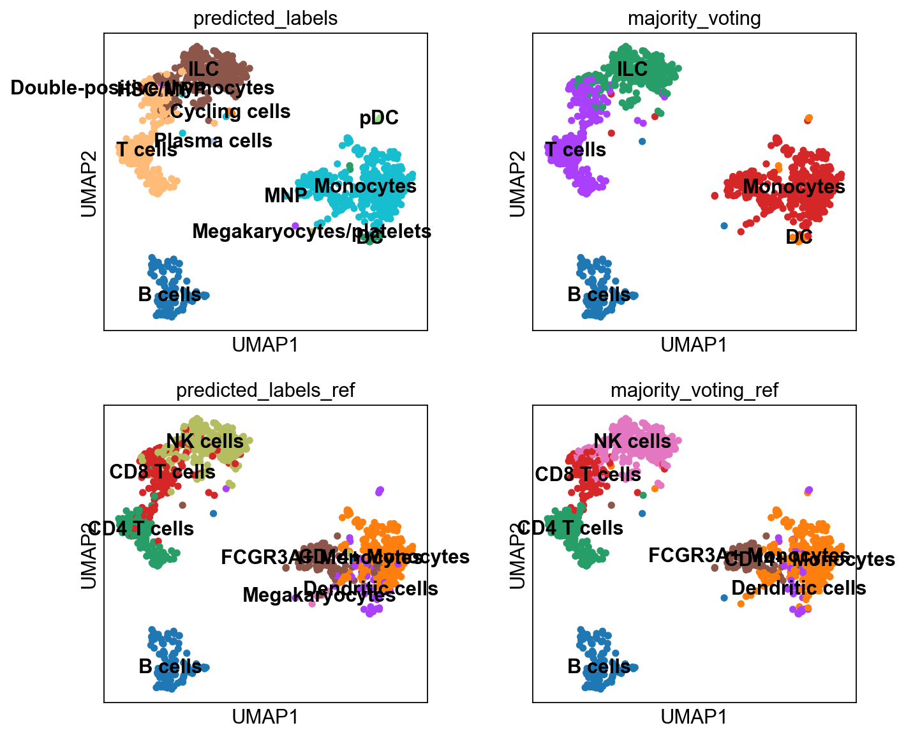
    


## Compare results

The predictions from ingest is stored in the column 'louvain' while we
named the label transfer with scanorama as 'predicted'


    
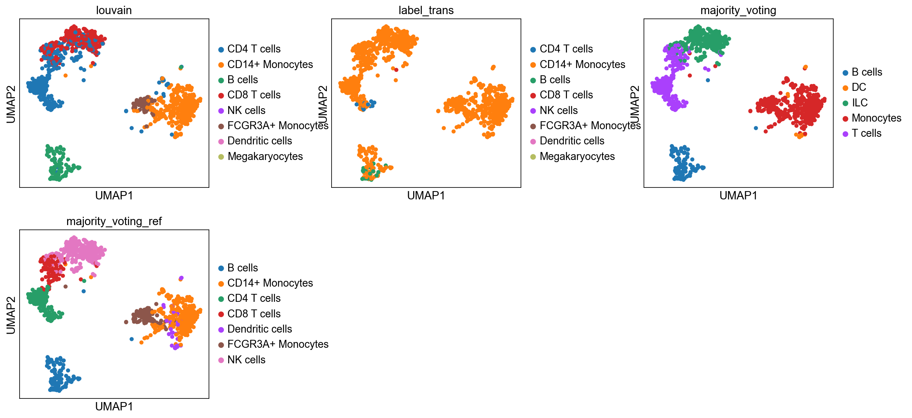
    


As you can see, the main celltypes are generally the same, but there are
clearly differences, especially with regards to the cells predicted as
either ILC/NK/CD8 T-cells.

The only way to make sure which method you trust is to look at what
genes the different celltypes express and use your biological knowledge
to make decisions.

## Gene set analysis

Another way of predicting celltypes is to use the differentially
expressed genes per cluster and compare to lists of known cell marker
genes. This requires a list of genes that you trust and that is relevant
for the tissue you are working on.

You can either run it with a marker list from the ontology or a list of
your choice as in the example below.

      % Total    % Received % Xferd  Average Speed   Time    Time     Time  Current
                                     Dload  Upload   Total   Spent    Left  Speed
    100 1416k  100 1416k    0     0   484k      0  0:00:02  0:00:02 --:--:--  484k


    (2868, 15)


    (445, 16)


    ranking genes
        finished (0:00:00)


    0


    ---------------------------------------------------------------------------

    TypeError                                 Traceback (most recent call last)

    Cell In[41], line 12
          9 print(cl)
         10 glist = sc.get.rank_genes_groups_df(adata, group=cl, key='wilcoxon')[
         11     'names'].squeeze().str.strip().tolist()
    ---> 12 enr_res = gseapy.enrichr(gene_list=glist[:300],
         13                          organism='Human',
         14                          gene_sets=gene_dict,
         15                          background=adata.shape[1],
         16                          cutoff=1)
         17 if enr_res.results.shape[0] == 0:
         18     pred[cl] = "Unass"


    File /opt/anaconda3/envs/scanpy/lib/python3.12/site-packages/gseapy/__init__.py:554, in enrichr(gene_list, gene_sets, organism, outdir, background, cutoff, format, figsize, top_term, no_plot, verbose)
        552 # set organism
        553 enr.set_organism()
    --> 554 enr.run()
        556 return enr


    File /opt/anaconda3/envs/scanpy/lib/python3.12/site-packages/gseapy/enrichr.py:643, in Enrichr.run(self)
        641 if self._isezid:
        642     g = {k: list(map(int, v)) for k, v in g.items()}
    --> 643 res = self.enrich(g)
        644 if res is None:
        645     self._logger.info("No hits returned for library: %s" % name)


    File /opt/anaconda3/envs/scanpy/lib/python3.12/site-packages/gseapy/enrichr.py:584, in Enrichr.enrich(self, gmt)
        582 bg = self.parse_background(gmt)
        583 self._logger.info(_gls[1:5])
    --> 584 self._logger.info(list(bg)[1:5])
        585 if isinstance(bg, set) and (not self._gene_isupper) and _gene_toupper:
        586     bg = {s.upper() for s in bg}  # convert bg to upper case, too


    TypeError: 'int' object is not iterable


    {}


    ---------------------------------------------------------------------------

    KeyError                                  Traceback (most recent call last)

    Cell In[43], line 2
          1 #| label: plot-gsea
    ----> 2 prediction = [pred[x] for x in adata.obs['leiden_0.6']]
          3 adata.obs["GS_overlap_pred"] = prediction
          5 sc.pl.umap(adata, color='GS_overlap_pred')


    KeyError: '3'


<div>

> **Discuss**
>
> As you can see, it agrees to some extent with the predictions from the
> methods above, but there are clear differences, which do you think
> looks better?

</div>

## Save data

We can finally save the object for use in future steps.

## Session info

```{=html}
<details>
```
```{=html}
<summary>
```
Click here
```{=html}
</summary>
```


<table class=table>
            <thead style="position: sticky; top: 0; background-color: var(--jp-layout-color0, var(--vscode-editor-background, white));">
        <tr><th>Package</th><th>Version</th></tr>
    </thead>
    <tbody>
        <tr><td><strong>numpy</strong></td><td>2.2.5</td></tr>
        <tr><td><strong>anndata</strong></td><td>0.11.4</td></tr>
        <tr><td><strong>pandas</strong></td><td>2.2.3</td></tr>
        <tr><td><strong>scanpy</strong></td><td>1.11.1</td></tr>
        <tr><td><strong>matplotlib</strong></td><td>3.10.3</td></tr>
        <tr><td><strong>scanorama</strong></td><td>1.7.4</td></tr>
        <tr><td><strong>scikit-learn</strong></td><td>1.5.2</td></tr>
        <tr><td><strong>celltypist</strong></td><td>1.6.3</td></tr>
        <tr><td><strong>gseapy</strong></td><td>1.1.8</td></tr>
    </tbody>
    <thead style="position: sticky; top: 0; background-color: var(--jp-layout-color0, var(--vscode-editor-background, white));">
        <tr><th>Component</th><th>Info</th></tr>
    </thead>
    <tbody>
        <tr><td>Python</td><td>3.12.9 | packaged by Anaconda, Inc. | (main, Feb  6 2025, 12:55:12) [Clang 14.0.6 ]</td></tr>
        <tr><td>OS</td><td>macOS-15.5-arm64-arm-64bit</td></tr>
        <tr><td>CPU</td><td>12 logical CPU cores, arm</td></tr>
        <tr><td>GPU</td><td>No GPU found</td></tr>
        <tr><td>Updated</td><td>2025-05-23 10:15</td></tr>
    </tbody>
        </table>

        <details>
        <summary>Dependencies</summary>
                <div style="max-height: min(500px, 80vh); overflow-y: auto;">
    <table class=table>
            <thead style="position: sticky; top: 0; background-color: var(--jp-layout-color0, var(--vscode-editor-background, white));">
    <tr><th>Dependency</th><th>Version</th></tr>
</thead>
<tbody>
    <tr><td>debugpy</td><td>1.8.11</td></tr>
    <tr><td>packaging</td><td>24.2</td></tr>
    <tr><td>threadpoolctl</td><td>3.6.0</td></tr>
    <tr><td>cffi</td><td>1.17.1</td></tr>
    <tr><td>stack-data</td><td>0.2.0</td></tr>
    <tr><td>platformdirs</td><td>4.3.7</td></tr>
    <tr><td>charset-normalizer</td><td>3.3.2</td></tr>
    <tr><td>pyparsing</td><td>3.2.3</td></tr>
    <tr><td>numba</td><td>0.61.2</td></tr>
    <tr><td>python-dateutil</td><td>2.9.0.post0</td></tr>
    <tr><td>traitlets</td><td>5.14.3</td></tr>
    <tr><td>statsmodels</td><td>0.14.4</td></tr>
    <tr><td>leidenalg</td><td>0.10.2</td></tr>
    <tr><td>tornado</td><td>6.4.2</td></tr>
    <tr><td>pynndescent</td><td>0.5.13</td></tr>
    <tr><td>Cython</td><td>3.1.0</td></tr>
    <tr><td>tqdm</td><td>4.67.1</td></tr>
    <tr><td>Pygments</td><td>2.19.1</td></tr>
    <tr><td>llvmlite</td><td>0.44.0</td></tr>
    <tr><td>appnope</td><td>0.1.3</td></tr>
    <tr><td>pillow</td><td>11.2.1</td></tr>
    <tr><td>annoy</td><td>1.17.3</td></tr>
    <tr><td>intervaltree</td><td>3.1.0</td></tr>
    <tr><td>cycler</td><td>0.12.1</td></tr>
    <tr><td>ipykernel</td><td>6.29.5</td></tr>
    <tr><td>scipy</td><td>1.15.3</td></tr>
    <tr><td>h5py</td><td>3.13.0</td></tr>
    <tr><td>executing</td><td>0.8.3</td></tr>
    <tr><td>pyzmq</td><td>26.2.0</td></tr>
    <tr><td>fbpca</td><td>1.0</td></tr>
    <tr><td>joblib</td><td>1.5.0</td></tr>
    <tr><td>psutil</td><td>5.9.0</td></tr>
    <tr><td>comm</td><td>0.2.1</td></tr>
    <tr><td>pycparser</td><td>2.21</td></tr>
    <tr><td>ipython</td><td>9.1.0</td></tr>
    <tr><td>typing_extensions</td><td>4.12.2</td></tr>
    <tr><td>pure-eval</td><td>0.2.2</td></tr>
    <tr><td>igraph</td><td>0.11.8</td></tr>
    <tr><td>PyYAML</td><td>6.0.2</td></tr>
    <tr><td>parso</td><td>0.8.4</td></tr>
    <tr><td>sortedcontainers</td><td>2.4.0</td></tr>
    <tr><td>six</td><td>1.17.0</td></tr>
    <tr><td>asttokens</td><td>3.0.0</td></tr>
    <tr><td>jupyter_core</td><td>5.7.2</td></tr>
    <tr><td>pytz</td><td>2025.2</td></tr>
    <tr><td>certifi</td><td>2025.4.26 (2025.04.26)</td></tr>
    <tr><td>setuptools</td><td>78.1.1</td></tr>
    <tr><td>urllib3</td><td>2.3.0</td></tr>
    <tr><td>defusedxml</td><td>0.7.1</td></tr>
    <tr><td>idna</td><td>3.7</td></tr>
    <tr><td>texttable</td><td>1.7.0</td></tr>
    <tr><td>PySocks</td><td>1.7.1</td></tr>
    <tr><td>matplotlib-inline</td><td>0.1.6</td></tr>
    <tr><td>session-info2</td><td>0.1.2</td></tr>
    <tr><td>jupyter_client</td><td>8.6.3</td></tr>
    <tr><td>requests</td><td>2.32.3</td></tr>
    <tr><td>patsy</td><td>1.0.1</td></tr>
    <tr><td>wcwidth</td><td>0.2.5</td></tr>
    <tr><td>Brotli</td><td>1.0.9</td></tr>
    <tr><td>kiwisolver</td><td>1.4.8</td></tr>
    <tr><td>umap-learn</td><td>0.5.7</td></tr>
    <tr><td>natsort</td><td>8.4.0</td></tr>
    <tr><td>decorator</td><td>5.1.1</td></tr>
    <tr><td>jedi</td><td>0.19.2</td></tr>
    <tr><td>array_api_compat</td><td>1.11.2</td></tr>
    <tr><td>legacy-api-wrap</td><td>1.4.1</td></tr>
    <tr><td>prompt-toolkit</td><td>3.0.43</td></tr>
</tbody>
    </table>
</div>
    </details>
        <details>
            <summary>Copyable Markdown</summary>
            <pre>| Package      | Version |
| ------------ | ------- |
| numpy        | 2.2.5   |
| anndata      | 0.11.4  |
| pandas       | 2.2.3   |
| scanpy       | 1.11.1  |
| matplotlib   | 3.10.3  |
| scanorama    | 1.7.4   |
| scikit-learn | 1.5.2   |
| celltypist   | 1.6.3   |
| gseapy       | 1.1.8   |

| Dependency         | Version                |
| ------------------ | ---------------------- |
| debugpy            | 1.8.11                 |
| packaging          | 24.2                   |
| threadpoolctl      | 3.6.0                  |
| cffi               | 1.17.1                 |
| stack-data         | 0.2.0                  |
| platformdirs       | 4.3.7                  |
| charset-normalizer | 3.3.2                  |
| pyparsing          | 3.2.3                  |
| numba              | 0.61.2                 |
| python-dateutil    | 2.9.0.post0            |
| traitlets          | 5.14.3                 |
| statsmodels        | 0.14.4                 |
| leidenalg          | 0.10.2                 |
| tornado            | 6.4.2                  |
| pynndescent        | 0.5.13                 |
| Cython             | 3.1.0                  |
| tqdm               | 4.67.1                 |
| Pygments           | 2.19.1                 |
| llvmlite           | 0.44.0                 |
| appnope            | 0.1.3                  |
| pillow             | 11.2.1                 |
| annoy              | 1.17.3                 |
| intervaltree       | 3.1.0                  |
| cycler             | 0.12.1                 |
| ipykernel          | 6.29.5                 |
| scipy              | 1.15.3                 |
| h5py               | 3.13.0                 |
| executing          | 0.8.3                  |
| pyzmq              | 26.2.0                 |
| fbpca              | 1.0                    |
| joblib             | 1.5.0                  |
| psutil             | 5.9.0                  |
| comm               | 0.2.1                  |
| pycparser          | 2.21                   |
| ipython            | 9.1.0                  |
| typing_extensions  | 4.12.2                 |
| pure-eval          | 0.2.2                  |
| igraph             | 0.11.8                 |
| PyYAML             | 6.0.2                  |
| parso              | 0.8.4                  |
| sortedcontainers   | 2.4.0                  |
| six                | 1.17.0                 |
| asttokens          | 3.0.0                  |
| jupyter_core       | 5.7.2                  |
| pytz               | 2025.2                 |
| certifi            | 2025.4.26 (2025.04.26) |
| setuptools         | 78.1.1                 |
| urllib3            | 2.3.0                  |
| defusedxml         | 0.7.1                  |
| idna               | 3.7                    |
| texttable          | 1.7.0                  |
| PySocks            | 1.7.1                  |
| matplotlib-inline  | 0.1.6                  |
| session-info2      | 0.1.2                  |
| jupyter_client     | 8.6.3                  |
| requests           | 2.32.3                 |
| patsy              | 1.0.1                  |
| wcwidth            | 0.2.5                  |
| Brotli             | 1.0.9                  |
| kiwisolver         | 1.4.8                  |
| umap-learn         | 0.5.7                  |
| natsort            | 8.4.0                  |
| decorator          | 5.1.1                  |
| jedi               | 0.19.2                 |
| array_api_compat   | 1.11.2                 |
| legacy-api-wrap    | 1.4.1                  |
| prompt-toolkit     | 3.0.43                 |

| Component | Info                                                                                |
| --------- | ----------------------------------------------------------------------------------- |
| Python    | 3.12.9 | packaged by Anaconda, Inc. | (main, Feb  6 2025, 12:55:12) [Clang 14.0.6 ] |
| OS        | macOS-15.5-arm64-arm-64bit                                                          |
| CPU       | 12 logical CPU cores, arm                                                           |
| GPU       | No GPU found                                                                        |
| Updated   | 2025-05-23 10:15                                                                    |</pre>
        </details>


```{=html}
</details>
```

## archive
