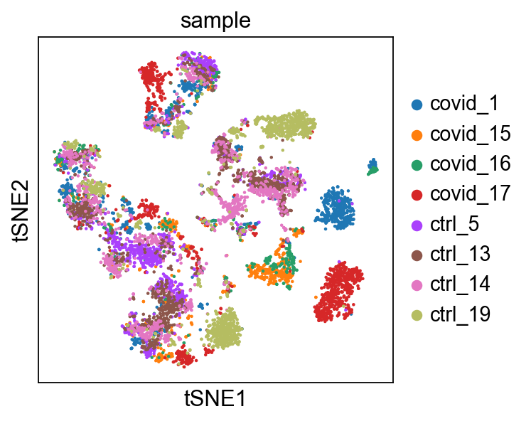

[ref: NBIS scanpy_02_dimred](https://nbisweden.github.io/workshop-scRNAseq/labs/scanpy/scanpy_02_dimred.html)

## 小结与体会

- 这里做了normalization并保存raw，这里是保存完整的表达数据，未经过筛选（比如高变异基因）
- dr会有筛选基因（高变异度的基因集）的步骤，仅用于聚类
- 这个步骤分析后发现了数据的批次效应，引入了在下个步骤做integration步骤的必要性
- 没必要单独作为一个步骤


## CN note: Data preparation

注意这里保存在 raw的归一化（normalization）且对数转化后的数据，但没做 scale.

```
# normalize to depth 10 000
sc.pp.normalize_total(adata, target_sum=1e4)
```
- [ ] 这个操作的标记，并不确定，需要研究下

## CN note: 特征选择是找高变异基因

- Pearson residuals for normalization of single-cell RNA-seq UMI data 这里的方法 variance-stabilizing transformations 也是来控制变异基因的贡献度，因为低表达基因的variance通常更大
- 这里的方法就是经典参数的沿用

## CN note: PCA

Based on this plot, we can see that the top 8 PCs retain a lot of information, while other PCs contain progressively less. However, it is still advisable to use more PCs since they might contain information about rare cell types (such as platelets and DCs in this dataset)
从该图可以看出，前 8 个 PC 保留了大量信息，而其他 PC 保留的信息则逐渐减少。然而，仍然建议使用更多 PC，因为它们可能包含有关稀有细胞类型的信息（例如此数据集中的血小板和树突状细胞）。
```
sc.tl.pca(
    n_comps=n
### n_comps 用来补充特定的PCA信息，这个可以在对聚类结果标注细胞类型后，再掉头来调试
#computing PCA
#    with n_comps=50
#    finished (0:00:06)
```


## CN note: tSNE

We plot the tSNE scatterplot colored by dataset. We can clearly see the effect of batches present in the dataset.

**重要的点是如何鉴定和发现批次效应/effect of batches**
这里的批次效应还是很明显的，特别是**红色的covid 17样品，基本是单独成一簇**



## CN note: UMAP

- 依然是批次效应的影响
- 会在下一步**Data Integration**中解决

## CN note: Genes of interest

- 只是看一下数据罢了，这里的细分群体因为批次效应，已经没什么意义了，随便看看

- The default is to plot gene expression in the normalized and log-transformed data. You can also plot it on the scaled and corrected data by using use_raw=False. However, not all of these genes are included in the variable gene set, and hence are not included in the scaled adata.X, so we first need to filter them.
- 默认设置是在标准化和对数转换后的数据中绘制基因表达图。你也可以使用 use_raw=False 将其绘制在缩放和校正后的数据上。然而，并非所有这些基因都包含在可变基因集中，因此它们不会包含在缩放后的 adata.X 中，所以我们首先需要对它们进行过滤。

**并且注意缩放后的数据和标准化后的数据的差异！！**


