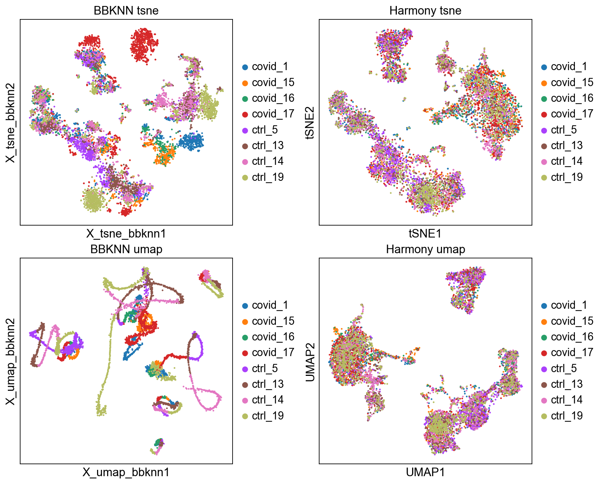

## 小结与体会

- 排除 batch var gene 进入分析：sc.pp.highly_variable_genes 的 batch_key 参数指定批次信息的参数
- Harmony直接简单粗暴，按照指定的 batch来源做PCA: sce.pp.harmony_integrate(adata, 'sample')
- 注意使用标记为X_pca_harmony的数据

## CN note

数据集成的本质就是批次效应去除


## CN note: Data preparation

- The new variable gene selection should not be performed on the
scaled data matrix.
- 变异基因选择不能在缩放数据上做。这里记住之前提出的，缩放动作会覆盖表达量的这个事实。

```python
adata = adata.raw.to_adata()

AnnData object with n_obs × n_vars = 7332 × 2656
    obs: 'type', 'sample', 'batch', 'n_genes_by_counts', 'total_counts', 'total_counts_mt', 'pct_counts_mt', 'total_counts_ribo', 'pct_counts_ribo', 'total_counts_hb', 'pct_counts_hb', 'percent_mt2', 'n_counts', 'n_genes', 'percent_chrY', 'XIST-counts', 'S_score', 'G2M_score', 'phase', 'doublet_scores', 'predicted_doublets', 'doublet_info'

    var: 'gene_ids', 'feature_types', 'genome', 'mt', 'ribo', 'hb', 'n_cells_by_counts', 'mean_counts', 'pct_dropout_by_counts',
          'total_counts', 'n_cells', 'highly_variable', 'means', 'dispersions',
          'dispersions_norm', 'mean', 'std'

    uns: 'doublet_info_colors', 'hvg', 'log1p', 'neighbors', 'pca', 'phase_colors', 'sample_colors', 'tsne', 'umap'
    obsm: 'X_pca', 'X_tsne', 'X_umap'
    varm: 'PCs'
    obsp: 'connectivities', 'distances'


    var: 'gene_ids', 'feature_types', 'genome', 'mt', 'ribo', 'hb', 'n_cells_by_counts', 'mean_counts', 'pct_dropout_by_counts',
       'total_counts', 'n_cells', 'highly_variable', 'means', 'dispersions',
       'dispersions_norm',
### batch_key= 启用后，新增的数据
'highly_variable_nbatches',
'highly_variable_intersection'

```

- [ ] 数据包中如何标记数据处理的步骤，是个需要团队达成一致的议题

```python
### 检查数据格式，如果是counts，则应该显示的是整数，如果归一化了，则会有小数
print(adata.X[1:50,1:50])
```
## CN note: Detect variable genes

- 不处理批次效应，直接检测变异基因，会混入批次特意基因
- sc.pp.highly_variable_genes 的 batch_key 参数，在之前的分析中是未启用的
> - 这里有几个新的参数启用
> - highly_variable_nbatches标记了 variable 出现在多少个批次里
> - 0 标记了非highly_variable gene
> - highly_variable_intersection 标记了是否在所有批次里都是 highly_variable gene
- Select all genes that are variable in at least 2 datasets and use for remaining analysis.
    - 选择至少 2 个数据集中可变的所有基因并用于剩余分析。这个解决方案就是排除掉单个批次特异性的因素
- 注意流程到了哪个阶段：选择完 variable genes 后，把scale 和 PCA 做掉了
    - [ ] 这里看不懂了，**需要回顾**
- 这里还注意**保存旧umap&tSNE的方法**


## CN note: BBKNN 

知道有这个方法就行了。重点方法是 Harmony


## CN note: Harmony

- 最popular 的 batch effect remove 方法，但也就是它需要独立安装需要注意一下

效果如下：

```python
for g in genes:
    plt.rcParams['axes.spines.left']   = True
    plt.rcParams['axes.spines.right']  = False
    plt.rcParams['axes.spines.top']    = False
    plt.rcParams['axes.spines.bottom'] = True
    
    plt.figure(figsize=(15, 5))
    
    colors = ['#1A63BE','#FBA002',  ]#  '#858CC4',
    # order = ['normal', 'EAC', 'ESCC']

    # 根据中位数排序
    value = g+", log2(TPM+1)"
    medians = exp.groupby('study')[value].median()
    sorted_categories = medians.sort_values(ascending=False).index
    print(sorted_categories[0:2])
    ax =sns.boxplot(y=value,x='study',data=exp[(~exp[value].apply(np.isinf))], 
                     palette=colors, 
                     order=sorted_categories,
                     showfliers=False, width=0.6
                    )
    interval = 2
    # plt.yticks(np.arange(0, np.max(exp[g+", log2TPM"]), interval))
    plt.yticks(np.arange(-4, 12, interval))

    plt.ylim(bottom=0,top=12)
    plt.xticks(rotation=90,fontsize=8)
    plt.title(g+' EXP in GTEx')
    ### 添加显著性检验的标记： Mann-Whitney： 
    pairs=[(sorted_categories[0], sorted_categories[1])]
    annotator = Annotator(ax, pairs, data=exp, x='study', y=g+", log2(TPM+1)", order=sorted_categories)
    annotator.configure(test='Mann-Whitney', text_format='star', loc='inside') ### 也叫Wilcoxon Rank Sum Test， 威尔科克森秩和检验
    annotator.apply_and_annotate()
    plt.savefig('.png', dpi=300, bbox_inches='tight')
    plt.show()
```
